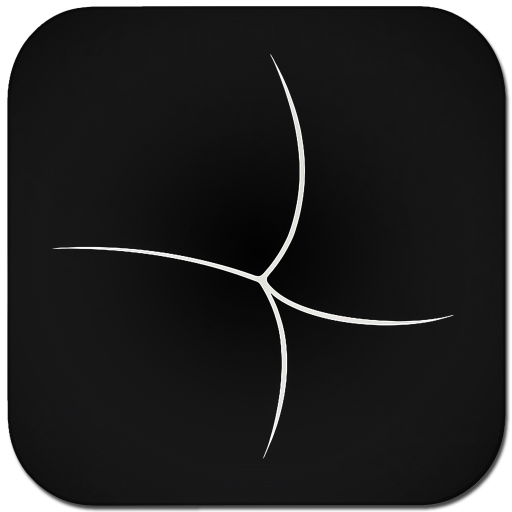

[English](../README.md) · [Русский](lang/ru/README.md)

  

<h1 align="center">BarkFluff documentation</h1>

  <strong>Focused setup guides for running, building, and exploring BarkFluff.</strong>

  <a href="../README.md">Overview</a> ·
  <a href="#backend">Backend</a> ·
  <a href="#clients">Clients</a>

---

Choose the guide for the part of the platform you are working with. Architecture, service conventions, and deeper implementation notes live in the [project knowledge base](../Obsidian/ClaudeVault/Index.md).

## Backend

- [Run and build the backend](backend.md)

## Clients

- [Android](clients/android.md)
- [Windows](clients/windows.md)
- [macOS](clients/macos.md)
- [iOS](clients/ios.md)
- [Linux](clients/linux.md)
- [Web](clients/web.md)

## Language editions

- [English project overview](../README.md)
- [Русская версия](lang/ru/README.md)

The operational guides are currently maintained in English. Add another language as `.readme/lang/<language-code>/README.md` and place its link in the language selectors above.
