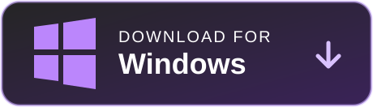
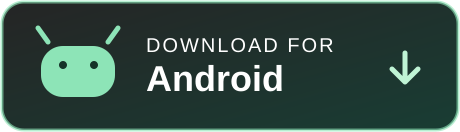

[English](../../../README.md) · [Русский](README.md)

  

<h1 align="center">BarkFluff</h1>

  <strong>Self-hosted мессенджер, спроектированный как распределённая система реального времени.</strong>

  <a href="#скачать">Скачать</a> ·
  <a href="#что-внутри">Платформа</a> ·
  <a href="#клиенты">Клиенты</a> ·
  <a href="../../README.md">Документация</a>

  
  
  
  

---

BarkFluff объединяет нативные клиенты и .NET-бэкенд с gRPC в основе. Клиенты находят сервисы через Beacon, получают события в потоковом режиме и напрямую обращаются к независимым сервисам, которые можно развивать и масштабировать без запутывания всей платформы.

  

## Скачать

  
  
  

  Релизные сборки для Windows, Android и macOS. Остальные клиенты доступны из исходников ниже.

## Что внутри

**Единая точка входа.** Beacon даёт клиентам доверенный способ обнаружить платформу; Configuration предоставляет реестр сервисов и runtime-настройки.

**Независимые продуктовые сервисы.** Авторизация, профили, сообщения, файлы, присутствие, звонки, боты, федерация и другое работают как сфокусированные .NET-сервисы — с CQRS и MediatR там, где это уместно.

**Реальное время по умолчанию.** Сервис Updates использует постоянные gRPC-стримы для событий продукта, а RabbitMQ переносит асинхронную работу между сервисами.

**Готовность к эксплуатации.** PostgreSQL хранит состояние, Redis обслуживает горячие данные, MinIO отвечает за объекты, а Docker запускает стек. Нативные и web-клиенты сделаны на Kotlin, WPF, SwiftUI, Qt и web-технологиях.

В [гайде по архитектуре](../../../Obsidian/ClaudeVault/Архитектура.md) описаны порты, аутентификация, доставка событий и соглашения сервисов.

## Клиенты

- **Android** — Kotlin и gRPC-OkHttp · [инструкция по сборке](../../clients/android.md)
- **Windows** — WPF и .NET · [инструкция по сборке](../../clients/windows.md)
- **macOS** — SwiftUI и gRPC-Swift · [инструкция по сборке](../../clients/macos.md)
- **iOS** — SwiftUI и gRPC-Swift · [инструкция по сборке](../../clients/ios.md)
- **Linux** — Qt 6, C++20 и gRPC · [инструкция по сборке](../../clients/linux.md)
- **Web** — gRPC-Web и vanilla-JS SPA · [инструкция по сборке](../../clients/web.md)

## Исследовать репозиторий

> ### 🧩 Платформа
> [`Backend/`](../../../Backend) содержит .NET-микросервисы и web-хосты. В [`Shared/`](../../../Shared) лежат protobuf-контракты и общие .NET-библиотеки.

> ### 📱 Клиенты
> В [`Android/`](../../../Android), [`Windows/`](../../../Windows), [`Mac/`](../../../Mac), [`iOS/`](../../../iOS) и [`Linux/`](../../../Linux) находятся нативные приложения. [`Frontend/`](../../../Frontend) содержит фронтенд портала для разработчиков.

> ### ⚙️ Инфраструктура
> В [`docker/`](../../../docker) лежат локальные стеки платформы и инфраструктуры. В [`Tests/`](../../../Tests) — автоматические и нагрузочные тесты.

> ### 📖 Документация
> [`.readme/`](../../) — публичный хаб запуска; [`Obsidian/ClaudeVault/`](../../../Obsidian/ClaudeVault) — база знаний проекта.

## Статус проекта

> ### 🚧 Активная разработка
> BarkFluff активно развивается. Android V1 — поддерживаемый Android-клиент; проект V2 на Jetpack Compose экспериментальный и должен меняться только в рамках отдельной задачи.

> ### ✅ Состояние сборок
> Статус клиентских workflow показан выше. Полная матрица доступна в [GitHub Actions](https://github.com/Liis17/BarkFluff/actions).

## Справка и документация

> ### 🛠️ Запуск и эксплуатация
> [Инструкция по бэкенду](../../backend.md) · [Порты и переменные окружения](../../../Backend/PORTS_CONFIGURATION.md) · [Справка по Docker](../../../Backend/DOCKER_SETUP.md) · [Реестр метрик](../../../Backend/METRICS.md)

> ### 📚 Изучить систему
> [Документационный хаб](../../README.md) · [Архитектура](../../../Obsidian/ClaudeVault/Архитектура.md) · [База знаний проекта](../../../Obsidian/ClaudeVault/Index.md)

> ### ⚖️ Лицензия
> [Лицензия MIT](../../../LICENSE)
