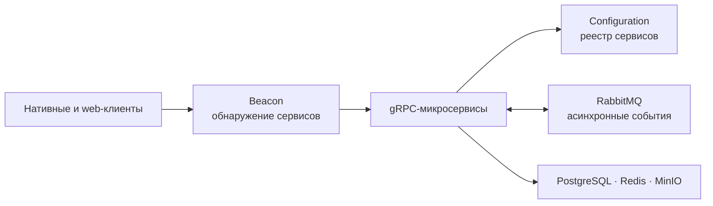

[English](../../../README.md) · [Русский](README.md)

<p align="center">
  
</p>

<h1 align="center">BarkFluff</h1>

<p align="center">
  <strong>Self-hosted мессенджер, спроектированный как распределённая система реального времени.</strong>
</p>

<p align="center">
  <a href="#запуск-платформы">Начать</a> ·
  <a href="#архитектура">Архитектура</a> ·
  <a href="#клиенты">Клиенты</a> ·
  <a href="../../README.md">Документация</a>
</p>

<p align="center">
  <a href="../../../LICENSE"></a>
  <a href="https://github.com/Liis17/BarkFluff/actions/workflows/build-client-android.yml"></a>
  <a href="https://github.com/Liis17/BarkFluff/actions/workflows/build-client-wpf.yml"></a>
  <a href="https://github.com/Liis17/BarkFluff/actions/workflows/build-client-macos.yml"></a>
</p>

---

BarkFluff объединяет нативные клиенты и .NET-бэкенд с gRPC в основе. Клиенты находят сервисы через Beacon, получают события в потоковом режиме и напрямую обращаются к независимым сервисам, которые можно развивать и масштабировать без запутывания всей платформы.

## Что внутри

| Слой | Задача | Технологии |
|---|---|---|
| **Вход в сервисы** | Даёт клиентам единую доверенную точку для обнаружения платформы | Beacon, Configuration, gRPC |
| **Продуктовые сервисы** | Авторизация, профили, сообщения, файлы, присутствие, звонки, боты, федерация и другое | .NET 10, CQRS, MediatR |
| **Реальное время** | Доставляет сообщения и события продукта по постоянным стримам | gRPC streaming, RabbitMQ |
| **Данные и эксплуатация** | Хранит состояние, кэширует горячие данные, выдаёт объекты и запускает стек | PostgreSQL, Redis, MinIO, Docker |
| **Клиенты** | Делает продукт доступным на десктопе, мобильных платформах и в web | Kotlin, WPF, SwiftUI, Qt, web |

## Архитектура



Путь запроса остаётся прямым: клиент получает адреса у **Beacon** и вызывает нужный сервис по gRPC. **Configuration** отдаёт сервисную конфигурацию, а **RabbitMQ** переносит асинхронные события между сервисами. В [гайде по архитектуре](../../../Obsidian/ClaudeVault/Архитектура.md) описаны порты, аутентификация, доставка событий и соглашения сервисов.

## Запуск платформы

Готовый development-стек запускает предсобранные образы бэкенда. Нужны Docker Engine с Compose, доступ к приватному registry и переменные окружения с учётными данными — они намеренно не хранятся в Git.

```bash
cd docker/backend
docker login docker.barkfluff.com:5000
docker compose -f docker-compose-dev-backend.yml config
docker compose -f docker-compose-dev-backend.yml up -d
```

В [инструкции по бэкенду](../../backend.md) есть требуемое окружение, конфигурация LiveKit, загрузка образов, безопасная остановка и сборка из исходников. Чтобы собрать один сервис во время разработки:

```bash
dotnet build Backend/BarkFluff.Identity/BarkFluff.Identity.csproj
```

## Клиенты

| Платформа | Стек | Инструкция |
|---|---|---|
| Android | Kotlin, gRPC-OkHttp | [Собрать Android](../../clients/android.md) |
| Windows | WPF, .NET | [Собрать Windows](../../clients/windows.md) |
| macOS | SwiftUI, gRPC-Swift | [Собрать macOS](../../clients/macos.md) |
| iOS | SwiftUI, gRPC-Swift | [Собрать iOS](../../clients/ios.md) |
| Linux | Qt 6, C++20, gRPC | [Собрать Linux](../../clients/linux.md) |
| Web | gRPC-Web и vanilla-JS SPA | [Собрать web](../../clients/web.md) |

## Карта репозитория

```text
BarkFluff/
├── Backend/       # .NET-микросервисы и web-хосты
├── Shared/        # protobuf-контракты и общие .NET-библиотеки
├── Android/       # поддерживаемый Android V1 и экспериментальный V2
├── Windows/       # WPF-клиенты и вспомогательные инструменты
├── Mac/ · iOS/    # SwiftUI-клиенты и локальные Swift-пакеты
├── Linux/         # Qt 6 / C++20 клиент
├── Frontend/      # фронтенд портала для разработчиков
├── docker/        # локальные стеки платформы и инфраструктуры
└── .readme/       # инструкции по запуску и сборке
```

## Статус проекта

BarkFluff активно развивается. Android V1 — поддерживаемый Android-клиент; проект V2 на Jetpack Compose экспериментальный и должен меняться только в рамках отдельной задачи.

| Клиент | `dev` | `master` |
|---|---|---|
| Android | [](https://github.com/Liis17/BarkFluff/actions/workflows/build-client-android.yml?query=branch%3Adev) | [](https://github.com/Liis17/BarkFluff/actions/workflows/build-client-android.yml?query=branch%3Amaster) |
| Windows (WPF) | [](https://github.com/Liis17/BarkFluff/actions/workflows/build-client-wpf.yml?query=branch%3Adev) | [](https://github.com/Liis17/BarkFluff/actions/workflows/build-client-wpf.yml?query=branch%3Amaster) |
| macOS | [](https://github.com/Liis17/BarkFluff/actions/workflows/build-client-macos.yml?query=branch%3Adev) | [](https://github.com/Liis17/BarkFluff/actions/workflows/build-client-macos.yml?query=branch%3Amaster) |

## Справка

- [Порты и переменные окружения бэкенда](../../../Backend/PORTS_CONFIGURATION.md)
- [Справка по Docker](../../../Backend/DOCKER_SETUP.md)
- [Реестр метрик](../../../Backend/METRICS.md)
- [База знаний проекта](../../../Obsidian/ClaudeVault/Index.md)
- [Лицензия MIT](../../../LICENSE)
