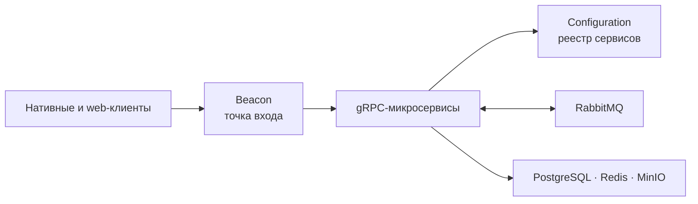

[English](../../../README.md) · [Русский](README.md)

# BarkFluff

**Распределённая self-hosted платформа обмена сообщениями в реальном времени.**

BarkFluff объединяет нативные клиенты и .NET-бэкенд, построенный вокруг gRPC. Платформа использует обнаружение сервисов, потоковые обновления и асинхронные события, поэтому части системы можно развивать независимо, сохраняя единый пользовательский опыт.

## Коротко о проекте

| | |
|---|---|
| **Бэкенд** | .NET 10, gRPC, RabbitMQ, PostgreSQL, Redis, MinIO, Docker |
| **Клиенты** | Android, Windows, macOS, iOS, Linux и web |
| **Реальное время** | gRPC-стриминг через сервис Updates |
| **Аутентификация** | XAuth: JWT и метаданные устройства |

## Как устроено взаимодействие



Клиенты запрашивают у **Beacon** адреса сервисов, а затем обращаются к ним напрямую по gRPC. Сервисы получают конфигурацию из **Configuration**, передают асинхронные события через RabbitMQ и используют PostgreSQL, Redis и MinIO по необходимости.

## С чего начать

| Что нужно сделать | Документация |
|---|---|
| Поднять или собрать бэкенд | [Backend](../../backend.md) |
| Собрать Android-клиент | [Android](../../clients/android.md) |
| Собрать Windows-клиент | [Windows](../../clients/windows.md) |
| Собрать macOS-клиент | [macOS](../../clients/macos.md) |
| Собрать iOS-клиент | [iOS](../../clients/ios.md) |
| Собрать Linux-клиент | [Linux](../../clients/linux.md) |
| Собрать web-клиент | [Web](../../clients/web.md) |
| Открыть все руководства | [Документационный хаб](../../README.md) |

## Карта репозитория

```text
BarkFluff/
├── Backend/       # .NET-микросервисы и хост web-клиента
├── Shared/        # protobuf-контракты и общие .NET-библиотеки
├── Android/       # Android V1 и экспериментальный V2
├── Windows/       # WPF-клиент и вспомогательные инструменты
├── Mac/           # SwiftUI-клиент для macOS и локальные Swift-пакеты
├── iOS/           # SwiftUI-клиент для iOS
├── Linux/         # Qt 6 / C++20 клиент
├── Frontend/      # фронтенд портала для разработчиков
└── .readme/       # инструкции по запуску и сборке
```

## Дополнительная документация

- [Порты и переменные окружения бэкенда](../../../Backend/PORTS_CONFIGURATION.md)
- [Справка по Docker](../../../Backend/DOCKER_SETUP.md)
- [Реестр метрик](../../../Backend/METRICS.md)
- [База знаний проекта](../../../Obsidian/ClaudeVault/Index.md)
- [Лицензия MIT](../../../LICENSE)

## Статус

Проект активно развивается. Поддерживаемым Android-клиентом является V1; проект V2 на Jetpack Compose — экспериментальный и не должен изменяться без отдельной задачи.
