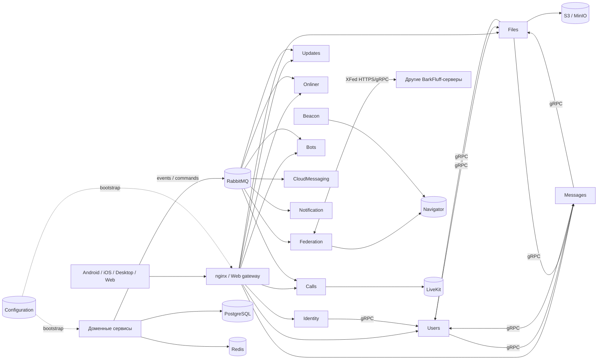
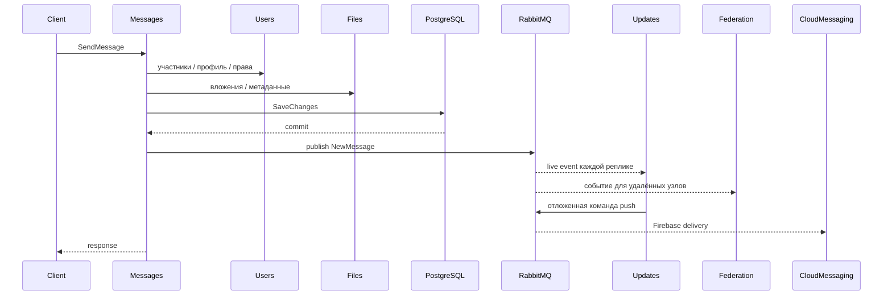
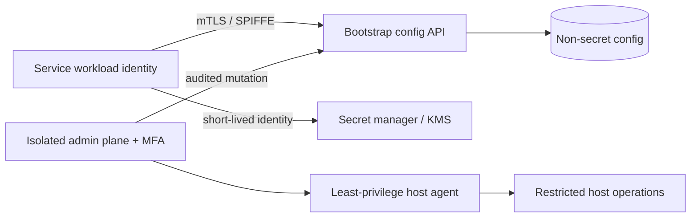

# Технический отчёт по архитектуре backend BarkFluff

**Дата проверки:** 13 августа 2026 года  
**Проверенная ревизия до добавления отчёта:** `bcb2857fb30a` (изменения после начала проверки затрагивали только Android; дерево `Backend/`, `Shared/` и `docker/` не менялось)  
**Область:** `Backend/`, `Shared/`, актуальный `docker/barkfluff/docker-compose.yml`, nginx-конфигурация, связанные файлы `Obsidian/ClaudeVault/` и `docs/Audit/`

## 1. Резюме

Backend BarkFluff — крупная событийно-ориентированная система из 20 запускаемых .NET-процессов, общей gRPC-инфраструктуры, RabbitMQ, PostgreSQL, Redis, S3-совместимого хранилища, LiveKit и внешних провайдеров. Основной функциональный разрез в целом последователен: синхронные запросы и проверки идут через gRPC, распространение событий — через RabbitMQ, состояние доменов разнесено по собственным хранилищам сервисов. Особенно хорошо проработан контур межсерверной федерации: подписи Ed25519, проверка временного окна, защита от SSRF, pinning ключей и сертификатов, outbox, дедупликация и dead-letter обработка. При этом транспортного nonce/replay-cache пока нет.

В текущем виде систему нельзя считать готовой к безопасному горизонтальному масштабированию и эксплуатации в недоверенной production-сети. Самые серьёзные причины:

1. **P0 — Configuration является общей точкой компрометации.** Внутренний gRPC API не аутентифицирует вызывающего, доверяет переданному `ServiceId` и позволяет читать и менять конфигурацию, включая глобальные секреты. Через этот же сервис приложения получают общий HMAC-ключ, RabbitMQ/DB credentials и долгоживущие service tokens.
2. **P0 — AdminPanel совмещает публичную плоскость управления с root-доступом к Docker host.** Контейнер получает `/var/run/docker.sock`, compose-файл и `.env`; компрометация панели практически равна компрометации узла и всех секретов.
3. **P1 — нет общей гарантии “запись в БД + публикация события”.** В большинстве доменных сервисов транзакция БД завершается до RabbitMQ publish. Сбой между действиями даёт сохранённую сущность без события, а повтор RPC — дубликат. Полноценный outbox реализован только внутри Federation.
4. **P1 — текущая схема Updates дублирует push при нескольких репликах и не контролирует backpressure.** Каждая реплика получает копию события, запускает локальный отложенный `Task.Run` и публикует push. Потоки пишутся конкурентно в `IServerStreamWriter`, без bounded-очереди и единого writer loop.
5. **P1 — модель сервисной аутентификации имеет слишком большой blast radius.** Все сервисы знают общий симметричный ключ; `Service` policy проверяет главным образом тип токена, а `User` policy принимает и пользовательские, и сервисные JWT. Компрометация одного сервиса позволяет подписывать доверенные системе токены без узких scopes/audience.
6. **P1 — есть подтверждённые проблемы безопасности на отдельных границах:** отключена TLS-проверка SMTP, локальная выдача файлов не проверяет владение/членство в чате, анонимные auth/reset API не имеют rate limit, Navigator сохраняет legacy-регистрацию без криптографического доказательства.
7. **P1 — свежий deployment не полностью воспроизводим.** Дефолтные LiveKit credentials не совпадают с `livekit.yaml`; для Developers отсутствует начальная конфигурация `DevelopersDb`, а порт в compose не совпадает с приложением.
8. **P1 — обнаружены транзитивные зависимости с High advisories:** `Microsoft.OpenApi 2.0.0`, `SQLitePCLRaw.lib.e_sqlite3 2.1.11`, `SSH.NET 2025.1.0`.
9. **P1 — ClientStorage может выдавать старый binary как актуальный release.** Cache key содержит только platform/channel, тогда как новая DB-запись публикуется до фонового обновления cache; окно гонки или ошибка прогрева смешивает новые metadata со старыми bytes.

Рекомендуемый порядок: сначала закрыть доверенную границу Configuration/AdminPanel и секреты, затем внедрить outbox/idempotency и исправить delivery-модель Updates, после этого укрепить auth/file/discovery границы, deployment и наблюдаемость.

## 2. Методика и ограничения

Проверка включала:

- чтение актуальной проектной базы знаний в `Obsidian/ClaudeVault/`;
- инвентаризацию всех проектов `Backend/` и общих библиотек `Shared/`;
- трассировку регистраций gRPC-клиентов, MassTransit consumers/producers, хранилищ и внешних интеграций;
- сопоставление исходников с `docker-compose`, nginx и существующими файлами `docs/Audit/`;
- последовательную сборку всех `Backend/**/*.csproj` и `Shared/**/*.csproj`;
- запуск всех доступных backend-тестовых проектов;
- `dotnet list package --vulnerable --include-transitive` для запускаемых проектов;
- точечную проверку критических обработчиков и межсервисных потоков.

Ограничения:

- не выполнялись penetration test, нагрузочный тест и chaos/failover test живого кластера;
- не проверялись реальные production ACL RabbitMQ/PostgreSQL/Redis/S3 и внешняя оркестрация, отсутствующие в репозитории;
- Rust-вариант Users изучен статически: `cargo` в среде отсутствует, поэтому `cargo test --locked` не запускался;
- Windows-часть решения на macOS не собиралась; это не относится к backend-проектам;
- line references ниже относятся к указанной ревизии и могут смещаться после правок.

Текущий исходный код считался источником истины. Старые аудиты использовались только как указатели: часть их замечаний уже исправлена, а часть ошибочно помечена как неактуальная при том, что проблема осталась в коде.

## 3. Состав системы

### 3.1. Запускаемые сервисы

| Сервис | Роль | Основное состояние и интеграции |
|---|---|---|
| `BarkFluff.Beacon` | Публикация сведений о локальном узле и регистрация в глобальном каталоге | Configuration, Navigator; собственного долговременного состояния нет |
| `BarkFluff.Bots` | Жизненный цикл ботов, bot API, получение событий сообщений | PostgreSQL, Redis, RabbitMQ; Users, Messages, Files, Identity |
| `BarkFluff.Calls` | Сигналинг и состояние звонков поверх LiveKit | PostgreSQL, RabbitMQ, LiveKit; Messages; часть quality-state в памяти |
| `BarkFluff.ClientStorage` | Хранилище и раздача клиентских сборок | SQLite, S3/MinIO, локальный кэш |
| `BarkFluff.Configuration` | Bootstrap-конфигурация и секреты всех локальных сервисов | PostgreSQL; внутренний gRPC API |
| `BarkFluff.FastAuth` | QR/быстрое связывание сессий | Память процесса; Identity gRPC |
| `BarkFluff.Federation` | Межсерверные XFed-запросы и репликация событий | PostgreSQL, RabbitMQ, HTTP/gRPC; Navigator и локальные доменные сервисы |
| `BarkFluff.Files` | Метаданные файлов, upload/download URL, федеративная передача | PostgreSQL, S3/MinIO, RabbitMQ; Users, Messages, Federation |
| `BarkFluff.Identity` | Регистрация, вход, JWT/refresh/reset, устройства | PostgreSQL, RabbitMQ; Users |
| `BarkFluff.Messages` | Чаты, сообщения, реакции, read-state, private/secret flows | PostgreSQL, Redis, RabbitMQ; Users, Files |
| `BarkFluff.Navigator` | Глобальный каталог серверов | SQLite; публичный gRPC API |
| `BarkFluff.Notification` | Отправка электронной почты | RabbitMQ, SMTP |
| `BarkFluff.Onliner` | Presence и typing | Redis/локальные подписки, RabbitMQ; Users, Messages, Federation |
| `BarkFluff.Updates` | Серверные streaming-подписки на события клиента | Локальные stream registries, RabbitMQ; публикует команды push |
| `BarkFluff.Users` | Профили, privacy, устройства, prekeys | PostgreSQL, RabbitMQ; Files, Messages, Federation |
| `BarkFluff.Web` | Web-клиент и YARP/gRPC-Web gateway | Browser storage; проксирование к локальным сервисам |
| `Barkfluff.AdminPanel` | Операционная и административная плоскость | gRPC ко многим сервисам, RabbitMQ, Docker socket, SMTP/Telegram/SSH/S3 |
| `Barkfluff.CloudMessaging` | Firebase push и dismiss/call/admin notifications | RabbitMQ, Firebase; Users, Messages |
| `Barkfluff.Developers` | Developer-документация, proto-каталог и справочник ошибок | PostgreSQL; Configuration bootstrap |
| `Barkfluff.WebServer` | Публичные web-страницы и support chat | Users gRPC; support-state в памяти, Telegram |

Дополнительно:

- `Backend/BarkFluff.GrpcServer` — общая runtime-библиотека, а не самостоятельный сервис: конфигурация, XAuth, exception interceptor, Serilog, RabbitMQ helpers и `/ping`.
- `Backend/BarkFluff.Users.Rust` — экспериментальная drop-in альтернатива Users, а не ещё одна одновременно запускаемая реплика. Она отстаёт от текущего proto/метрик и не включена в основной compose.
- `FederationTestbed` — средство разработки, не production-микросервис.

### 3.2. Граница deployment

Актуальный `docker/barkfluff/docker-compose.yml` запускает 17 приложений узла: Beacon, Configuration, Files, Identity, Messages, Notification, Users, FastAuth, Updates, Onliner, Federation, CloudMessaging, Web, Developers, Calls, Bots и AdminPanel, а также инфраструктуру.

Navigator, WebServer и ClientStorage относятся к глобальному/внешнему контуру и в этом compose отсутствуют. Это допустимое разделение, но в репозитории нет единого проверяемого deployment manifest, показывающего их совместимую production-топологию, readiness и порядок обновления.

Почти все сервисы образуют плоский доверенный сегмент. Внутренние gRPC, RabbitMQ, Redis и PostgreSQL в compose работают без mTLS. Многие образы используют `:latest`; отсутствуют унифицированные healthchecks, resource limits и log rotation. `depends_on` задаёт порядок запуска, но не готовность зависимостей.

### 3.3. Высокоуровневая схема



## 4. Синхронные зависимости gRPC

| Вызывающий сервис | Синхронные зависимости | Назначение |
|---|---|---|
| Beacon | Configuration, Navigator | Сведения об узле и регистрация |
| Bots | Users, Messages, Files, Identity | bot account, отправка/чтение сообщений и файлов, токены |
| Calls | Messages | Проверка/состояние чата при звонке |
| CloudMessaging | Users, Messages | Устройства, параметры уведомлений, контекст сообщений |
| AdminPanel | Users, Files, Identity, Messages, Configuration, Bots, Federation | Администрирование узла |
| FastAuth | Identity | Создание сессии пользователя после QR-flow |
| Federation | Navigator, Users, Messages, Files, Onliner | Discovery и применение входящих/исходящих XFed операций |
| Files | Users, Messages, FederationInternal | Авторизация, контекст чатов, федеративные файлы |
| Identity | Users | Создание/поиск пользовательского домена |
| Messages | Users, Files | Участники, профили и вложения |
| Onliner | Users, Messages, FederationInternal | Visibility, membership и удалённое presence/typing |
| Users | Files, Messages, FederationInternal | Аватары, связанные сообщения и федеративные профили |
| WebServer | Users | Публичные страницы пользователей |
| Web | Почти все client-facing сервисы | YARP/gRPC-Web proxy, а не доменный вызов |

Configuration, Navigator, Notification, Updates, ClientStorage и Developers в основном не вызывают другие доменные gRPC API в рабочем пути.

У большинства клиентов настраиваются адрес, JWT/XAuth и exception interceptor, но нет общей политики deadline, retry, circuit breaker или bulkhead. Особенно чувствителен цикл `Users ↔ Messages ↔ Files`: деградация одного участника увеличивает latency и каскадно исчерпывает ресурсы остальных. Retry для mutating RPC без idempotency key дополнительно опасен.

## 5. RabbitMQ и доставка событий

### 5.1. Карта consumers/producers

| Контур | Очереди/события | Текущая семантика |
|---|---|---|
| Identity, Users, Files, Messages | Session revoked | Уникальная non-durable auto-delete очередь на экземпляр; fan-out через exchange |
| Messages | Profile name/avatar changed, federated chat rejected | Durable competing consumers; сервис также публикует lifecycle/read/encrypted/secret события |
| Updates | New/edit/delete/read/pin/private/secret и session revoked | Уникальные auto-delete очереди на экземпляр: каждая реплика получает копию для своих локальных streams |
| Onliner | Presence, typing, session revoked | Уникальные per-instance очереди для локальных подписчиков |
| Calls | Call delivery, session revoked; member kicked | Локальный fan-out; `chat-member-kicked-calls` — durable competing queue |
| Federation | New/edit/delete/read для удалённых узлов; revoke/presence | Доменные federation queues durable и competing; локальные revoke/presence per-instance; дополнительно PG outbox/dead letter/dedup |
| CloudMessaging | Push, dismiss, admin broadcast, call, private invite | Durable competing queues |
| Notification | Email command | Durable competing queue |
| Bots | New messages, email, bot updates/registry | Доменные очереди durable; локальные registry/update fan-out per instance |
| AdminPanel | Broadcast command | Producer для CloudMessaging/операционных действий |

### 5.2. Что работает правильно

- Разделены **competing consumer** очереди для одиночного выполнения side effect и **per-instance fan-out** для доставки локальным streaming-подписчикам.
- Federation имеет собственные outbox, dead-letter, deduplication и retry/backoff механизмы.
- Долговечные бизнес-команды CloudMessaging, Notification и часть Bots/Calls не привязаны к жизни конкретной реплики.
- Названия очередей обычно изолируют контуры сервисов.

### 5.3. Системные пробелы

В общей MassTransit-конфигурации не найдено унифицированных `UseMessageRetry`, scheduled redelivery, consumer outbox, prefetch/concurrency limits и классификации transient/permanent ошибок. В результате фактическая политика зависит от того, пробросил ли конкретный consumer исключение. Есть handlers, которые перехватывают исключение и подтверждают сообщение — это необратимая потеря.

События одного агрегата разнесены по разным очередям и не несут единого sequence/cursor. RabbitMQ сохраняет порядок только в пределах конкретной очереди и consumer path, поэтому `edit/delete/read` может быть увидено клиентом раньше `new message`, а после разрыва stream нет общего replay-протокола.

Per-instance auto-delete очереди подходят для локальной live-доставки, но не для security invalidation как единственного источника истины. Если экземпляр был выключен во время `session revoked`, после старта его пустой локальный cache снова принимает access token до его истечения.

## 6. Основные end-to-end потоки

### 6.1. Аутентификация

1. Клиент обращается к Identity через edge/gRPC-Web.
2. Identity читает собственную БД и синхронно вызывает Users для пользовательского домена.
3. Identity выдаёт access JWT и refresh token; revocation распространяется через RabbitMQ.
4. Остальные сервисы валидируют JWT общим HMAC-ключом, полученным из Configuration.

Слабые места: общий signing secret, plaintext refresh tokens, отсутствие rotation/reuse detection, почти бессрочный refresh TTL и отсутствие rate limit на анонимных auth/reset методах.

### 6.2. Отправка сообщения



Критическое окно находится между DB commit и publish. Если publish завершился ошибкой, сообщение уже существует, но downstream его не увидит; RPC может вернуть ошибку, и повтор создаст второе сообщение, потому что proto не содержит client idempotency key.

### 6.3. Live updates и push

Updates держит локальные gRPC streams каждой реплики. Для этого per-instance RabbitMQ fan-out архитектурно оправдан. Однако тот же consumer планирует push: каждая реплика после локальной задержки публикует одинаковую команду, поэтому число push растёт с числом реплик. Локальный `Task.Run` теряется при рестарте.

Правильное разделение:

- per-instance fan-out — только доставка в локальные streams;
- одна durable competing queue — планирование внешнего push side effect;
- distributed deduplication/idempotency key — защита от повторной доставки;
- bounded `Channel<T>` и один writer loop на stream — порядок и backpressure;
- cursor/sequence и краткий replay — восстановление после reconnect.

### 6.4. Федерация

Локальные события Messages/Users/Files попадают в Federation, затем сохраняются в federation outbox и отправляются удалённому узлу по XFed. Входящий запрос проверяет подпись, свежесть timestamp/body hash, discovery identity и ограничения SSRF; применение делегируется локальному доменному сервису. Это самый зрелый delivery-контур проекта, но freshness window без nonce/cache допускает повтор идентичного RPC внутри окна.

Оставшиеся риски: private signing seed хранится в PostgreSQL открытым материалом; первичный локальный publish до Federation всё ещё не защищён доменным outbox; полноценный history catch-up RPC не реализован; ручная настройка peers может ослабить HTTPS policy при ошибке оператора.

### 6.5. Файлы

Files хранит метаданные в PostgreSQL и объекты в S3/MinIO. Между upload/delete в object storage и записью БД нет атомарности/компенсации. Для федеративного download проверяется requester, но локальная ветка выдачи temporary URL не проверяет, что пользователь владеет объектом или состоит в чате. Глобальный hash lookup дополнительно раскрывает существование одинакового файла и добавляет нового пользователя в `Uploaders`.

### 6.6. Звонки

Calls проверяет chat context через Messages, создаёт состояние звонка, выдаёт LiveKit token, обрабатывает подписанный webhook и распространяет call events через RabbitMQ. Webhook verification и sweeper реализованы разумно; запись состояния, publish и LiveKit side effects не объединены outbox/saga.

## 7. Приоритетная таблица рисков

Шкала: **P0** — немедленно опасная trust boundary/компрометация узла; **P1** — высокий риск безопасности, потери данных или неверной business-семантики; **P2** — существенный эксплуатационный/масштабный долг; **P3** — локальное улучшение без срочного системного влияния.

| ID | Приоритет | Область | Итог |
|---|---|---|---|
| BF-01 | P0 | Configuration | Неаутентифицированное чтение/изменение общей конфигурации и секретов |
| BF-02 | P0 | AdminPanel / host | Публичная management plane имеет root-equivalent Docker socket и `.env` |
| BF-03 | P1 | Auth/XAuth | Общий HMAC-ключ и слишком широкие policies дают большой lateral-movement radius |
| BF-04 | P1 | Identity | Нет rate limit; практически бессрочные plaintext refresh tokens без rotation |
| BF-05 | P1 | Данные/RabbitMQ | Нет transactional outbox и command idempotency в большинстве сервисов |
| BF-06 | P1 | Updates | Push дублируется по числу реплик; локальный scheduler теряет задания |
| BF-07 | P1 | Streaming | Нет single writer/backpressure/order/replay; revocation не закрывает активные streams |
| BF-08 | P1 | Files | Локальный temporary URL и hash dedup не обеспечивают tenant/chat ACL |
| BF-09 | P1 | Notification | SMTP TLS certificate validation отключена глобально |
| BF-10 | P1 | Discovery | Navigator принимает legacy-регистрацию без proof; Beacon использует именно её |
| BF-11 | P1 | Deployment | LiveKit/Developers fresh-deploy конфигурации несовместимы |
| BF-12 | P1 | Supply chain | Три группы High dependency advisories |
| BF-13 | P2 | Onliner | Неограниченные подписки и последовательный N+1 Users RPC |
| BF-14 | P1 | CloudMessaging | Ошибки проглатываются и ACK’аются; push теряется без retry/DLQ |
| BF-15 | P2 | FastAuth | Process-local state без общей cardinality quota, replica affinity и невозможность re-subscribe |
| BF-16 | P2 | Web/WebServer | Долгоживущие browser tokens; анонимный in-memory support chat без rate/TTL |
| BF-17 | P2 | ClientStorage | DoS-параметры upload и слабая гарантия подлинности client artifact |
| BF-18 | P2 | Operations | Startup migrations, слабые healthchecks, нет tracing/SLO и backup job |
| BF-19 | P2 | Rust Users | Реализация отстала; shared revoke queue ломает invalidation при scale-out |
| BF-20 | P1 | ClientStorage | Cache key не связан с release; старые bytes могут выдаваться как новая версия |
| BF-21 | P1 | Federation/Messages | Объявленный `ExportChatEvents` не реализован; полноценного catch-up/repair нет |
| BF-22 | P2 | Federation XFed | Timestamp ограничивает свежесть, но идентичный signed RPC повторяем в пределах окна |
| BF-23 | P2 | Request context | Клиентский `x-ip-address` позволяет подменять IP в логах/security notifications |
| BF-24 | P2 | Общий gRPC | Unknown exceptions раскрывают `ex.Message`; streaming RPC не охвачены interceptor |
| BF-25 | P2 | Files | Параллельные uploads до 100 MB буферизуются в RAM и могут исчерпать heap |

## 8. Подробные замечания и рекомендации

### BF-01 — Configuration не имеет надёжной границы доверия

**Подтверждение.** `Backend/BarkFluff.Configuration/Program.cs:41-46,148-151` регистрирует и публикует gRPC API/reflection без XAuth. В `Backend/BarkFluff.Configuration/Host/ConfigurationApiService.cs:31-40,58-70,82-97` вызывающий сам передаёт `ServiceId`, может получить всю конфигурацию и вызвать update; audit identity также берётся из request. `Backend/BarkFluff.Configuration/Persistence/Services/ConfigurationStorage.cs:20-25,30-36,39-66` объединяет requested service с глобальным `Unknown` и выполняет изменения без выведенной из соединения identity. Общий bootstrap в `Backend/BarkFluff.GrpcServer/WebApplicationBuilderExtensions.cs:61-92` синхронно обращается к этому API до настройки обычной auth-модели.

**Последствие.** Порт Configuration не опубликован на host, поэтому это не прямой Internet exposure. Но плоская docker network означает, что компрометация любого контейнера или пригодный SSRF позволяют:

- прочитать глобальный JWT HMAC secret, DB/Rabbit/S3 credentials и service tokens;
- выдать себя за любой `ServiceId`;
- изменить endpoint/secret другого сервиса и закрепиться в узле;
- вывести все сервисы из строя некорректной конфигурацией.

Секреты хранятся в БД как обычные значения и один раз загружаются в память при старте; rotation/reload протокола нет. Долгоживущие service tokens усиливают последствия утечки.

В модели не видно уникального ограничения на `(ServiceId, Section, Key)`. Handler группирует global/service-local значения и правильно предпочитает локальное, поэтому сам конфликт override не роняет bootstrap. Однако при двух дубликатах одного уровня используется недетерминированный `First()`: сервис может получить случайное значение, а последующее update изменит только одну из записей.

`docs/Audit/BarkFluff.Configuration.md` помечает близкие замечания как «неактуальные», хотя текущий код сохраняет проблему. Этот аудит нуждается в повторной верификации после исправления.

**Рекомендация.** Простого `AddXAuth` недостаточно: возникает цикл — XAuth secret сам получается из Configuration. Нужна отдельная bootstrap identity:

1. mTLS/SPIFFE identity либо короткоживущий per-service bootstrap credential, выданный оркестратором;
2. `ServiceId` выводится из аутентифицированной identity, а не из request;
3. read API выдаёт только allowlist конкретного сервиса;
4. mutation API отделён, доступен только административной identity и ведёт неизменяемый audit log;
5. секреты переносятся в secret manager/envelope encryption, в Configuration остаются ссылки/несекретные параметры;
6. уникальный индекс `(ServiceId, Section, Key)`, очистка существующих дубликатов и сохранение детерминированного override global/service values;
7. network policy запрещает обращаться к bootstrap API неавторизованным workload.

### BF-02 — AdminPanel имеет root-equivalent доступ к узлу

**Подтверждение.** `docker/barkfluff/docker-compose.yml:223-270` запускает AdminPanel с root-полномочиями и монтирует `/var/run/docker.sock`, compose и `.env`. Панель имеет широкие gRPC/service credentials, а также SMTP, Telegram, SSH и S3 интеграции.

`Backend/Barkfluff.AdminPanel/Pages/v2/Login.html:309-316,329-337` записывает `auth_token` из JavaScript без гарантий `HttpOnly`, `Secure` и `SameSite`; status endpoint возвращает raw token клиентскому коду. Встроенного rate limiting не найдено.

**Последствие.** XSS, auth bypass, утечка token или RCE в панели превращаются в доступ к Docker API: запуск privileged container, чтение volumes/секретов и полный контроль host. Монтирование `.env` дополнительно превращает file-read в компрометацию credentials.

**Рекомендация.** Убрать прямой socket. Вынести операции в отдельный минимальный privileged agent/socket proxy с allowlist конкретных команд и взаимной аутентификацией. AdminPanel запускать non-root, изолировать отдельной management network/VPN, применить серверную cookie-сессию (`HttpOnly; Secure; SameSite=Strict`), CSRF protection, MFA, rate limit и подробный audit. Compose и `.env` не должны быть доступны web-процессу.

### BF-03/BF-04 — сервисная и пользовательская аутентификация

**Подтверждение.** В `Backend/BarkFluff.GrpcServer/XAuth/XAuthExtensions.cs:23-33,74-84` сервисы валидируют общий симметричный ключ; policy `Service` в основном различает token type, а `User` допускает `User` или `Service`. Per-service scopes/audience для доменных операций нет.

В Identity:

- анонимные login/register/reset/OTP методы видны в `Backend/BarkFluff.Identity/Host/IdentityApiService.cs:46-99,166-191`;
- у password reset нет attempt counter/lockout (`Backend/BarkFluff.Identity/Features/ConfirmResetPassword/ConfirmResetPasswordCommandHandler.cs:72-150`);
- refresh token TTL задаётся как 9999 дней (около 27 лет), а service/bot JWT фактически живут до года 9999 (`Backend/BarkFluff.Identity/Services/JwtService.cs:33-59` и handlers выдачи токенов);
- refresh token хранится открытым значением (`Backend/BarkFluff.Identity/Persistence/Services/RefreshTokensStorage.cs:11-35`);
- `Backend/BarkFluff.Identity/Features/CreateToken/CreateTokenCommandHandler.cs:17-72` не делает обязательную rotation family/reuse detection.

Актуальный nginx применяет `limit_req` только к Beacon, FastAuth и Federation (`docker/nginx/sites/00-rate-limits.conf` и соответствующие sites). Для Identity ограничения нет ни в приложении, ни в текущей nginx-конфигурации.

**Рекомендация.** Перейти на асимметричную сервисную identity или workload mTLS; выдавать короткоживущие JWT с `iss/aud/sub`, узкими scopes и независимыми ключами. `User` policy не должна автоматически означать доступ сервису — для внутренних обходов нужна отдельная явная policy. Refresh tokens хранить как hash, сделать короткий sliding TTL, одноразовую rotation family и reuse detection/revoke-all. Для password/OTP/reset нужны IP+account rate limits, progressive delay, attempt budget и security audit events.

### BF-05 — нарушение атомарности между БД и RabbitMQ

**Подтверждение.** В типичном пути `Backend/BarkFluff.Messages/Features/SendMessage/SendMessageCommandHandler.cs:526,547-570` сначала вызывается сохранение БД, затем publish. `Shared/BarkFluff.Proto/messages_api.proto:228-240` не содержит client command/idempotency key. Аналогичный порядок встречается в Users, Identity, Calls и Bots. Federation outbox начинается только после того, как исходное доменное событие уже дошло до Federation, поэтому не восстанавливает потерю на первом publish.

**Failure modes.**

- DB commit успешен, RabbitMQ недоступен: сущность есть, события нет;
- RPC возвращает ошибку после commit, клиент повторяет команду: дубликат;
- consumer выполнил side effect и упал до ack: повторный side effect;
- два сервиса изменяются последовательно: частично завершённый workflow без компенсации.

**Рекомендация.** Для каждого сервиса, который изменяет собственную БД и публикует событие:

- transactional outbox в той же DB transaction;
- отдельный dispatcher с retry/backoff и observable lag;
- стабильный `event_id`, `aggregate_id`, `aggregate_version`, `occurred_at`;
- idempotent inbox/processed-message ledger у consumers с необратимым side effect;
- `command_id`/idempotency key в mutating client API;
- saga/compensation для межсервисных операций (например, удаление bot user + bot record, Calls + LiveKit, Files + S3).

### BF-06 — push дублируется при scale-out Updates

**Подтверждение.** `Backend/BarkFluff.Updates/Program.cs:60-67` создаёт уникальную очередь на экземпляр, поэтому каждый экземпляр получает `NewMessage`. `Backend/BarkFluff.Updates/Features/PushNotifications/PushNotificationSchedulerHandler.cs:53-129` на каждом экземпляре запускает локальный `Task.Run`, ждёт около пяти секунд и публикует push для получателей.

При `N` репликах получается до `N` одинаковых push-команд. Рестарт процесса стирает отложенные задачи; локальный tracker не даёт межрепличной дедупликации.

**Рекомендация.** Вынести scheduler в отдельную durable competing queue либо в persisted scheduled-message mechanism. Ключ дедупликации — `(message_id, recipient_device_id, notification_kind)`. Updates fan-out handler должен заниматься только локальным gRPC stream. Аналогично проверить dismiss/прочие внешние side effects.

### BF-07 — streaming/backpressure/order/revocation

**Подтверждение.** `Backend/BarkFluff.Updates/Features/SubscribeNewMessages/Handlers/NewMessageNotificationHandler.cs:37-77` создаёт задачи на подписчиков и непосредственно вызывает `IServerStreamWriter.WriteAsync`; исключения поглощаются, после чего RabbitMQ delivery считается обработанной. Такой шаблон повторяется в нескольких Updates handlers и в `Backend/BarkFluff.Onliner/Services/OnlineStatusNotifier.cs:55-57,94-113`/TypingNotifier.

gRPC stream не поддерживает несколько конкурентных writers. Нет bounded buffer, write deadline, явной политики для медленного клиента и персистентного cursor. У одного клиента существует множество раздельных event streams, поэтому глобальный порядок между new/edit/delete/read отсутствует и расходуется много HTTP/2 streams.

Revocation consumers заполняют локальный cache, но не закрывают уже открытые streams. Проверка токена выполняется при подключении. Non-durable per-instance queue означает, что выключенная реплика пропускает revoke.

**Рекомендация.** Объединить client updates в один typed per-device stream. На stream: bounded `Channel`, один writer loop, write timeout, max queue/streams, политика coalesce/drop/disconnect, cancellation и активное закрытие по revoke. Каждому event дать monotonically ordered cursor/aggregate version и серверный replay/reconciliation API. Источник revocation должен быть durable/authoritative; локальный cache — только ускорение.

### BF-08 — локальный Files ACL и глобальный hash dedup

**Подтверждение.** `Backend/BarkFluff.Files/Features/GetTempDownloadUrl/GetTempDownloadUrlCommandHandler.cs:40-67` для локального файла возвращает ID/temporary URL без проверки requester ownership или chat membership; `RequesterUserId` реально используется в federation path (`:118-145`). `Backend/BarkFluff.Files/Host/FilesApiService.cs:47-75` аутентифицирует пользователя, но локальный handler не применяет identity.

`Backend/BarkFluff.Files/Features/CheckFileHash/CheckFileHashCommandHandler.cs:51-63` выполняет глобальный поиск hash, возвращает существующий `FileId` и добавляет запросившего в `Uploaders`. Это создаёт cross-tenant presence oracle и потенциальную выдачу объекта по заранее известному hash. Прямой original-download ограничен типами avatar/chat picture/poster, но это не заменяет ACL temporary URL.

**Рекомендация.** Связать file object с owner/chat/message и проверять capability на каждой выдаче URL. Dedup выполнять внутри tenant/security domain либо возвращать лишь “upload not needed” через непрозрачный capability, не раскрывая глобальный `FileId`. Добавить negative tests: чужой user, удалённый из чата user, guessed hash, deleted message, federated requester. Для S3↔DB операций нужны pending state/compensation и orphan sweeper.

### BF-09 — SMTP TLS и неполная RabbitMQ retry policy

**Подтверждение.** `Backend/BarkFluff.Notification/Senders/EmailSender.cs:37-38` безусловно принимает любой TLS certificate. Это позволяет MITM и утечку SMTP credentials/содержимого писем. Комментарий в `Backend/BarkFluff.Notification/Consumers/EmailQueueConsumer.cs:45-53` рассчитывает на MassTransit retries, но `Backend/BarkFluff.Notification/Program.cs:26-43` их не настраивает; фактическое поведение — перевод fault в error queue, а не заявленная application retry policy.

**Рекомендация.** Вернуть стандартную проверку chain/hostname; dev CA устанавливать в trust store, а не отключать validation. Для всех очередей задокументировать retry matrix: transient network/provider failures — exponential redelivery с jitter; validation/permanent failures — немедленный DLQ; side effects — idempotency key. Настроить prefetch/concurrency и alarms по error/dead-letter/age.

### BF-10 — legacy discovery позволяет отравить Navigator

**Подтверждение.** `Backend/BarkFluff.Navigator/Host/NavigatorApiService.cs:35-68` допускает анонимную регистрацию. `Backend/BarkFluff.Navigator/Features/RegisterServer/RegisterServerCommandHandler.cs:137-156` проверяет proof только при наличии `ServerName`; legacy path остаётся без криптографической идентичности. `Backend/BarkFluff.Navigator/Persistence/ServersStorage.cs:26-40` строит legacy identity/throttle из выбранных атакующим Name+Host+Port. При этом `Backend/BarkFluff.Beacon/BackgroundServices/ServerRegistrationService.cs:56-79` не отправляет `ServerName`, signing keys и federation endpoint — обычный deployed flow использует именно legacy path.

**Последствие.** Каталог можно загрязнять/перезаписывать ложными endpoint, а SQLite/single-node Navigator становится глобальным availability bottleneck.

**Рекомендация.** Сделать proof обязательным для каждой регистрации; identity должна выводиться из подписанного server key, а endpoint подтверждаться challenge. Legacy protocol удалить после миграционного окна. Добавить global/IP/key quota и durable replicated storage. Beacon должен регистрировать полную XFed identity и периодически подтверждать её.

### BF-11 — fresh deployment не воспроизводим

Подтверждены как минимум два несовпадения:

1. `Backend/BarkFluff.Configuration/Infrastructure/ConfigurationDefaultsPopulator.cs:475-484` создаёт LiveKit `devkey/devsecret_change_me...`, тогда как `docker/barkfluff/livekit/livekit.yaml:9-13` использует `barkfluffkeys/your_key`. Calls подписывает token/webhook конфигурационными ключами (`Backend/BarkFluff.Calls/Program.cs:49-68,134-174`, `Backend/BarkFluff.Calls/Services/LiveKitTokenService.cs:27-41`), поэтому чистый deployment не сможет нормально соединиться с LiveKit.
2. `ServiceId.Developers = 12` (`Shared/BarkFluff.Shared.Identity/ServiceId.cs:29`), Developers запрашивает `DevelopersDb` (`Backend/Barkfluff.Developers/Program.cs:21,41-46`), но для него нет migration/default/populator entry в Configuration. В `Backend/Barkfluff.Developers/appsettings.json:10` сервис слушает 7020, а `docker/barkfluff/docker-compose.yml:183-194` публикует `4425:4425`; актуального nginx site для Developers также нет.

Дополнительно многие сервисы вызывают `Database.Migrate()` при старте каждой реплики. Одновременный rollout создаёт гонки и связывает application startup с DDL permissions. Bootstrap Configuration выполняется синхронно без общей deadline/retry политики. `/ping` возвращает только `pong`, а Web `/health` проверяет главным образом сам процесс, не критические зависимости.

**Рекомендация.** Добавить clean-environment smoke test, который поднимает compose, ждёт readiness и выполняет auth/send/update/file/call probes. Все credentials генерировать/передавать одним источником. Миграции выполнять отдельным singleton job до rollout. Ввести startup/liveness/readiness: readiness проверяет DB/Rabbit/critical bootstrap, но не создаёт thundering herd. Зафиксировать версии images/digests.

### BF-12 — High dependency advisories

Результат `dotnet list package --vulnerable --include-transitive`:

| Пакет | Advisory | Затронутые runtime-проекты |
|---|---|---|
| `Microsoft.OpenApi 2.0.0` | High, `GHSA-v5pm-xwqc-g5wc` | Beacon, FastAuth, Federation, Files, Identity, Messages, Notification, Onliner, Users, AdminPanel, WebServer |
| `SQLitePCLRaw.lib.e_sqlite3 2.1.11` | High, `GHSA-2m69-gcr7-jv3q` | ClientStorage, Navigator |
| `SSH.NET 2025.1.0` | High, `GHSA-q939-rpr3-3284` | AdminPanel |

CloudMessaging также использует obsolete `GoogleCredential.FromJson(string)`, для которого SDK предупреждает о риске работы с непроверенным credential JSON. В тестах появляется лицензионное предупреждение FluentAssertions 8.10; это не runtime vulnerability, но требует юридического решения/фиксации версии.

**Рекомендация.** Обновить direct owner package, который подтягивает уязвимую версию, проверить changelog и compatibility, затем повторить полный build/test и составить SBOM. Добавить dependency audit в CI с fail policy для reachable High/Critical и documented exception process.

### BF-13 — Onliner имеет N+1 и неограниченные локальные подписки

`Backend/BarkFluff.Onliner/Features/SubscribeToOnlineStatus/SubscribeToOnlineStatusQueryHandler.cs:43-64` не ограничивает количество локальных user IDs. `Backend/BarkFluff.Onliner/Services/OnlineVisibilityFilter.cs:26-47` последовательно вызывает Users для каждого target — latency и нагрузка растут линейно, что даёт простой authenticated DoS. Для удалённых UUID cap есть в `Backend/BarkFluff.Onliner/Host/OnlinerApiService.cs:151-165`, то есть правила расходятся. Typing subscription lists также не имеют ясного общего лимита, а reverse indexes растут в памяти.

Privacy `FRIENDS` сейчас трактуется как скрытое состояние до появления relationship service (`Backend/BarkFluff.Onliner/Services/OnlineVisibilityFilter.cs:6-9,59-61`), то есть функциональность privacy неполна.

**Рекомендация.** Ввести одинаковые caps, batch Users API/cache, параллелизм с лимитом, cancellation/deadline и quota на user/device/IP. Добавить relationship source или явно убрать неподдерживаемую опцию из клиента до реализации.

### BF-14 — CloudMessaging подтверждает потерянные push

`Backend/Barkfluff.CloudMessaging/Consumers/PushNotificationConsumer.cs:125-134` перехватывает общий exception и завершает consumer без fault, поэтому RabbitMQ message подтверждается и теряется. `Backend/Barkfluff.CloudMessaging/Services/FirebaseService.cs` также поглощает часть ошибок; unregistered tokens помечены TODO и не удаляются (`:163-194`). Chunking по 500 сделан для admin broadcast (`:517-545`), но обычные/call/web/dismiss paths могут передать весь набор в один multicast request. Ошибка Firebase initialization не блокирует readiness — процесс может выглядеть healthy, ничего не отправляя.

**Рекомендация.** Классифицировать Firebase errors, transient пробрасывать в retry/redelivery, permanent token errors удалять/деактивировать, все batches ограничить документированным provider limit. Добавить delivery idempotency, метрики success/transient/permanent/dead-token и readiness состояния SDK/credentials.

### BF-15 — FastAuth не масштабируется без affinity

`Backend/BarkFluff.FastAuth/Infrastructure/FastAuthSessionsManager.cs:9-43` хранит sessions только в singleton dictionary. Анонимный generate path не имеет application rate limit; nginx ограничивает лишь запросы с одного IP и до 10 streams, что не даёт distributed/account quota. `Backend/BarkFluff.FastAuth/Domain/FastAuthSession.cs:34-49` фиксирует subscriber, но не отсоединяет его при disconnect; до expiry повторная подписка невозможна. `Backend/BarkFluff.FastAuth/Host/FastAuthServerApiService.cs:13-17` остаётся unimplemented.

**Рекомендация.** Если feature должен переживать scale/restart — хранить short-lived state в Redis с atomic claim/TTL и pub/sub, либо явно обеспечить sticky routing и graceful drain. Добавить global/IP/device quotas, detach в `finally`, reconnect semantics и реализовать/удалить мёртвый server API contract.

### BF-16 — Web и WebServer

Web хранит access и refresh tokens в `localStorage/sessionStorage` (`Backend/BarkFluff.Web/wwwroot/js/app/tokens.js:15-50`). При почти бессрочном refresh token любая XSS становится долгоживущим account takeover. В `Backend/BarkFluff.Web/Program.cs:137-149` есть базовые `nosniff`, referrer и frame headers, но не найден строгий CSP.

WebServer support API анонимно принимает caller GUID и до 4000 символов, не имеет rate/auth (`Backend/Barkfluff.WebServer/Controllers/SupportChatController.cs:23-58`) и пересылает сообщения администратору в Telegram. `Backend/Barkfluff.WebServer/Services/SupportChatService.cs:7-58` держит неограниченную историю в памяти без TTL/persistence; знание GUID позволяет читать диалог. Это даёт spam/memory DoS и потерю обращений при рестарте.

**Рекомендация.** Для Web предпочтителен BFF: refresh token — rotating HttpOnly cookie, access token — только memory; добавить строгий CSP/Trusted Types и XSS tests. Для support — opaque high-entropy session capability, rate/CAPTCHA, bounded TTL storage, content controls, size/count limits и явная privacy/retention политика.

### BF-17 — ClientStorage

`Backend/BarkFluff.ClientStorage/Program.cs:38-60` доверяет всем forwarded headers, допускает upload до 512 MB/30 минут и отключает minimum data rate. `/set` защищён одним статическим bearer (`Backend/BarkFluff.ClientStorage/Middleware/TokenAuthMiddleware.cs:21-41`), downloads публичны. Artifact проверяется SHA checksum, но не code-signature/trusted publisher metadata. В `Backend/BarkFluff.ClientStorage/Controllers/ClientStorageController.cs:388-446` S3 upload предшествует SQLite update без компенсации; DB failure оставляет orphan/temp object.

**Рекомендация.** Ограничить trusted proxies/networks, вернуть body-rate/header/time limits, upload выполнять через presigned multipart с quota. Статический bearer заменить короткоживущей scoped CI identity. Публикация должна быть двухфазной: upload pending → signature/hash verify → atomic metadata publish; фоновой sweeper удаляет orphan. Клиенты должны проверять platform code signature, не только hash из того же канала.

### BF-18 — эксплуатация и наблюдаемость

- В 11 проектах migrations запускаются приложением при старте.
- `/ping` из `Backend/BarkFluff.GrpcServer/PingEndpointExtensions.cs:9-12` не отражает readiness.
- Нет сквозного OpenTelemetry/`ActivitySource` и W3C trace propagation через gRPC, RabbitMQ, DB и внешние HTTP; доступны Serilog/Seq и разрозненные counters.
- Не найден backup job/restore test для stateful volumes.
- В compose отсутствуют единые CPU/memory limits, restart/readiness policy, pinning image digest и log limits.
- Host ports PostgreSQL/Seq расширяют поверхность атаки; внешняя сеть плоская.
- PostgreSQL mapping `${POSTGRES_PORT}:${POSTGRES_PORT}` корректен только если container действительно слушает тот же нестандартный порт, тогда как default внутри образа — 5432.

**Рекомендация.** Добавить SLO/SLI для latency/error/queue age/outbox lag/stream count/push delivery, distributed traces с correlation/event IDs, structured security audit, dashboards и paging. Проверять backup restore регулярно. Разделить edge/app/data/management networks, включить TLS/mTLS и least-privilege credentials. Ввести canary/rolling deployment с graceful stream drain.

### BF-19 — Rust-вариант Users не эквивалентен основному

Obsidian прямо помечает `BarkFluff.Users.Rust` как устаревший экспериментальный drop-in. В proto/реализации отсутствует часть актуального контракта, включая federation `User.Uuid` и новые метрики. В `Backend/BarkFluff.Users.Rust/src/queue.rs:28,176-235` session revocation использует одну durable shared queue: реплики конкурируют за сообщение, хотя invalidation должна попасть в каждую. В том же файле (`:115-164`) publishers игнорируют результат `publish` (`let _ = ...`) и увеличивают published metrics даже при ошибке.

**Рекомендация.** Не считать Rust production-ready. Либо удалить/архивировать до появления владельца, либо завести contract parity suite против одного proto, одинаковые integration tests и per-instance fan-out revocation. Publish errors должны влиять на handler result/метрики. Перед решением необходимы `cargo test`, migration compatibility и rolling-replacement test с .NET Users.

### BF-20 — ClientStorage смешивает новую release-запись со старым cache

**Подтверждение.** `Backend/BarkFluff.ClientStorage/Infrastructure/LocalFileCache.cs:17-35` строит cache path только из `(ClientType, ReleaseChannel)`, без `S3Key`, checksum или version. `Backend/BarkFluff.ClientStorage/Controllers/ClientStorageController.cs:275-305` сначала читает newest DB row, но затем без сверки отдаёт любой файл из этого cache path с filename/content type новой строки. При публикации новая строка фиксируется в БД на `:427-446`, а cache обновляется fire-and-forget после ответа (`:458-487`); ошибка лишь логируется.

**Последствие.** В нормальном окне гонки между DB commit и cache replacement, а при любой постоянной ошибке фонового прогрева endpoint версии говорит «новая версия», но download возвращает bytes предыдущего release под новым именем/metadata. Для канала обновлений это P1 correctness и supply-chain risk: клиент может повторять обновление, получить checksum/signature mismatch либо установить не ту версию.

**Рекомендация.** Сделать release immutable и content-addressed: cache key включает `S3Key` или checksum. Download должен брать cache только при точном совпадении manifest с выбранной DB row, иначе читать именно её S3 object. Публиковать указатель channel→release атомарно только после upload, проверки подписи/hash и готовности cache (либо вовсе не требовать cache для корректности). Фоновая ошибка должна быть наблюдаема, но не способна менять выдаваемую версию.

### BF-21 — нет полноценного federation catch-up/repair

`Shared/BarkFluff.Proto/messages_api.proto:608,876-882` объявляет `MessagesServerApi.ExportChatEvents`, но `Backend/BarkFluff.Messages/Host/MessagesServerApiService.cs:43-45` прямо оставляет этап до реализации и не override’ит RPC; generated base возвращает `Unimplemented`.

Federation outbox надёжно повторяет уже принятые им события, но не лечит события, потерянные до Federation, исторический gap после дефекта/ручного восстановления или расхождение двух узлов. Без range export/cursor нет полного способа доказать и восстановить равенство истории.

**Рекомендация.** Реализовать ограниченный и авторизованный export по chat + aggregate/event sequence range, snapshot watermark и hash/manifest. При reconnect/расхождении Federation сравнивает watermarks, догружает gap и идемпотентно применяет события. Нужны quotas, pagination, cancellation, audit и integration tests: потеря середины истории, долго недоступный peer, дубликаты и конфликт версий.

### BF-22 — XFed freshness window не является полной anti-replay защитой

`Backend/BarkFluff.Federation/Services/XFedCanonicalString.cs:6-16` подписывает origin, destination, timestamp, method и body hash, но не nonce/request ID. `Backend/BarkFluff.Federation/Host/XFedServerInterceptor.cs:91-121,146-170` проверяет подпись и допустимое временное окно (по умолчанию 300 секунд), но не запоминает уже принятые запросы. Поэтому перехваченный идентичный signed RPC можно повторить в пределах окна. Доменный `event_id`/ProcessedEvents уменьшает эффект для некоторых event endpoints, но transport-wide гарантии нет.

**Рекомендация.** Добавить подписанный `x-bf-request-id` и распределённый replay cache с atomic `SET NX`/TTL, ключом `(origin, request_id)` и сроком не меньше signature window. Все mutating handlers всё равно должны быть идемпотентны. Метрики должны различать clock-skew, duplicate nonce и invalid signature; окно следует сделать минимальным, совместимым с контролируемой синхронизацией часов.

### BF-23 — IP в request context контролируется клиентом

`Backend/BarkFluff.GrpcServer/Tracker/RequestContextInterceptor.cs:61-120` ставит base64 metadata `x-ip-address` выше `X-Forwarded-For`, `X-Real-IP` и TCP `RemoteIpAddress`, не проверяет, что источник доверенный, и вызывает `Convert.FromBase64String` без безопасной валидации. Identity использует это значение для геолокации, auth/security писем и логов; FastAuth сохраняет его в session context.

**Последствие.** Клиент подменяет IP/географию в security telemetry и уведомлениях, затрудняя расследование и будущие abuse controls. Некорректный base64 создаёт исключение до handler. Прямое доверие обычным forwarded headers также безопасно только при настроенном списке trusted proxies.

**Рекомендация.** Удалить client-supplied IP metadata из trust path. Канонический адрес выводить из `RemoteIpAddress` после `ForwardedHeadersMiddleware` с `KnownProxies/KnownNetworks`; входящие forwarding headers от недоверенных peers отбрасывать. Проверять `IPAddress.TryParse`, нормализовать адрес и передавать его как server-derived context. Некорректные device metadata ограничивать по длине/формату и возвращать `InvalidArgument`, не exception details.

### BF-24 — общий gRPC exception handler неполон и раскрывает детали

`Backend/BarkFluff.GrpcServer/ServerExceptionInterceptor.cs:24-112` override’ит только `UnaryServerHandler`. Server-, client- и duplex-streaming RPC обходят общую классификацию/метрики. Для неизвестного exception на `:91-110` наружу возвращается `StatusCode.Unknown` с сырым `ex.Message`, который может содержать SQL/provider/path/config details.

**Рекомендация.** Для unexpected exception возвращать стабильный публичный код и нейтральный текст, а детали связывать с server-side correlation/error ID. Реализовать одинаковую оболочку для всех четырёх gRPC call shapes, сохранив cancellation semantics. Проверить interceptor order и добавить contract tests на business exception, unexpected exception, auth failure и ошибку во время каждого streaming shape.

### BF-25 — Files буферизует крупные параллельные uploads в heap

HTTP controller принимает multipart до 512 MB (`Backend/BarkFluff.Files/Host/FilesController.cs:42-58`). `Backend/BarkFluff.Files/Features/UploadFile/UploadFileCommandHandler.cs:127-164` отправляет video или файл больше 100 MB во временный файл, но любой другой upload до 100 MB полностью копирует в `MemoryStream`; обработка изображений создаёт дополнительные byte arrays/streams.

Несколько параллельных uploads около порога способны быстро занять сотни мегабайт managed heap, вызвать LOH pressure/GC pauses или OOM. Authenticated capability ограничивает круг атакующих, но global concurrency/cardinality quota не видна.

**Рекомендация.** Потоково считать SHA-256 и писать в bounded disk/object-storage pipeline; память использовать только для малого явно заданного порога. Добавить per-user/IP/global concurrency и byte-rate quotas, temp-disk limit/sweeper, cancellation и метрики active uploads/in-flight bytes/GC/temp usage. Image decoder также должен иметь pixel/dimension limits против decompression bombs.

## 9. Оценка каждого сервиса

### 9.1. Beacon

Небольшой stateless service с понятной ответственностью: собрать описание узла и зарегистрировать его в Navigator. nginx rate limit для публичного API присутствует. Основной недостаток — несовместимость с защищённым Navigator flow: `Backend/BarkFluff.Beacon/BackgroundServices/ServerRegistrationService.cs` отправляет legacy payload без server identity/proof. Получение server info также хрупкое: `Backend/BarkFluff.Beacon/Features/GetServerInfo/GetServerInfoCommandHandler.cs:47-81` требует успеха серии примерно из десяти запросов Configuration; один сбой рушит ответ. `ParseService` (`:139-167`) считает сервис healthy по наличию external endpoint, а не по probe.

**Итог:** код прост, но Beacon сейчас поддерживает небезопасный discovery protocol и выдаёт декларативное, а не фактическое здоровье.

### 9.2. Bots

Сильные стороны: PostgreSQL/Redis разделены по назначению, есть distributed rate limit, poll guard, token-id revocation и per-instance event fan-out. Основные gaps:

- `Backend/BarkFluff.Bots/Features/DeleteBot/DeleteBotCommandHandler.cs:44-48` сначала удаляет Users account, затем запись Bots; второй сбой оставляет частично завершённую операцию;
- `Backend/BarkFluff.Bots/Services/BotRegistryCache.cs:66-80` делает invalidation fire-and-forget; при сбое другие реплики могут хранить stale registry без гарантированного TTL/reconciliation;
- доменные изменения не имеют общей outbox/idempotency гарантии.

**Итог:** один из более зрелых scale-out сервисов, но межсервисные операции требуют saga/compensation, а cache invalidation — надёжного repair path.

### 9.3. Calls

Сильные стороны: LiveKit webhook проверяется SDK-подписью, есть durable ring sweeper, локальный event fan-out, session revocation удаляет участника, stream writes сериализуются через `SemaphoreSlim`. Основные gaps: Call/LiveKit/Rabbit side effects неатомарны (`Backend/BarkFluff.Calls/Features/CallLifecycle/CallLifecycleHandler.cs:103-142` и соседние paths), stream не имеет bounded queue/write timeout, а `Backend/BarkFluff.Calls/Services/CallQualityStore.cs:13-22` process-local. При scale-out изменение quality видно только реплике, обработавшей команду; другая вернёт `Auto` даже без рестарта. Group call history неполна.

**Итог:** хорошая основа signaling, но нужна saga/outbox и явная модель деградации LiveKit/stream.

### 9.4. ClientStorage

Функция отделена от доменного backend и использует SQLite+S3. Есть checksum и локальный cache. Критичные замечания описаны в BF-17/BF-20: доверие forwarded headers, большие/медленные uploads, один статический publish bearer, отсутствие code-signature trust, неатомарность S3/SQLite и возможность выдать старые cached bytes как новую release-запись.

**Итог:** пригодно как внутренний distribution service, но не как высокодоверенный production software-update root без hardening и подписи artifacts.

### 9.5. Configuration

Сервис централизует bootstrap и уменьшает дублирование конфигурации, но одновременно является самым крупным trust bottleneck. Помимо BF-01, defaults содержат production-небезопасные placeholder credentials, включая LiveKit и `minioadmin`; runtime reload/rotation нет.

**Итог:** P0 до переработки bootstrap identity, secret distribution и mutation plane.

### 9.6. FastAuth

Protocol прост, TTL ограничивает жизнь QR session пятью минутами, nginx имеет request/connection limit. Но состояние полностью локально и недолговечно, общей cardinality/quota нет, disconnect блокирует повторную подписку, rate limit не распределён, server API незавершён.

**Итог:** работает для одной реплики/короткой сессии; scale-out и graceful restart не определены.

### 9.7. Federation

Самый сильный сервис по security/resilience:

- Ed25519 XFed signatures, body hash и проверка freshness timestamp;
- well-known discovery, DNS pinning/SSRF protections и SPKI continuity;
- PostgreSQL outbox, retry/backoff, dead letter, inbox/dedup и ordering;
- quotas и отдельные internal/external API.

Оставшиеся gaps: seed private signing key хранится в PostgreSQL (`Backend/BarkFluff.Federation/Persistence/Contexts/FederationContext.cs:28-33` и signing-key model), поэтому read access к БД означает impersonation узла. Federation outbox не закрывает потерю события до входа в сам Federation; XFed не имеет replay cache (BF-22), а history repair не завершён (BF-21). Test host сейчас сломан для двух XFed integration tests из-за отсутствующей DI-регистрации `FederationS2SApiHandler`, хотя production `Program` её регистрирует.

**Итог:** хороший референс для outbox/dedup остальных сервисов; ключи следует вынести в KMS/HSM/envelope encryption и восстановить integration fixture.

### 9.8. Files

Разделение metadata/object storage и federation path логично. Сервис выдаёт собственные opaque capability URL `/upload/{Guid}` и `/download/{Guid}`, поэтому byte traffic проходит через Files, а не уходит клиенту по прямому S3 presigned URL. Недостатки: локальный ACL/hash oracle (BF-08), неатомарность S3↔DB, RAM pressure параллельных uploads (BF-25) и зависимость от Users/Messages/Federation без единой resilience policy.

Важно: старое замечание о безусловно public buckets в текущем `S3Initializer` не подтверждено — initializer только создаёт buckets. Его не следует переносить в новый backlog без проверки реальной S3 policy.

**Итог:** перед multi-tenant production нужен capability-based ACL и reconciliation object store/DB.

### 9.9. Identity

Домен выделен правильно, reset/login/device flows покрыты значительным числом unit/integration tests. Главные риски — BF-03/BF-04: слишком широкая общая trust model, отсутствие abuse controls, долгоживущие plaintext refresh tokens без rotation/reuse detection. Session revocation зависит от пропускаемого per-instance event.

**Итог:** функционально развит, но security posture токенов и анонимных endpoints требует срочного усиления.

### 9.10. Messages

Крупнейший доменный сервис: чаты, messages, read state, pin/reactions, private/secret flows и federation hooks. Положительно, что актуальные read handlers проверяют доступ; старые IDOR-замечания о `MarkAsRead` в текущей версии не подтверждаются.

Недостатки:

- DB→Rabbit окно и отсутствие command idempotency (BF-05);
- много синхронных Users/Files вызовов без standard deadlines/circuit breaker;
- `Backend/BarkFluff.Messages/Persistence/Services/SecretMessageBuffer.cs:63-68,184-199` использует Redis pipeline, но не атомарную transaction/script; get-then-delete допускает гонку;
- `Backend/BarkFluff.Messages/Persistence/Services/PrivateChatInviteStore.cs:22-38` не задаёт TTL и отдельно читает/удаляет invite, оставляя stale/race behavior;
- `MessagesServerApi.ExportChatEvents` объявлен в proto, но не реализован, поэтому Federation не имеет полноценного gap repair (BF-21);
- раздельные lifecycle queues не дают общего порядка клиенту.

**Итог:** функционально богат, но требует outbox/idempotency, atomic Redis scripts и единого event ordering contract.

### 9.11. Navigator

Минимальный глобальный directory service на SQLite. Главная проблема — BF-10: анонимный legacy registration без proof остаётся реальным Beacon path. SQLite/single instance и отсутствие явно проверенного HA делают Navigator глобальной точкой отказа.

**Итог:** необходимо завершить signed discovery protocol и определить replicated/backup deployment.

### 9.12. Notification

Изоляция email в RabbitMQ consumer — правильная граница. Однако глобальное отключение TLS certificate validation является прямым security defect, а ожидаемая retry policy фактически отсутствует.

**Итог:** небольшой по объёму, но P1 до восстановления TLS verification и явного retry/DLQ поведения.

### 9.13. Onliner

Per-instance queues хорошо соответствуют локальным подписчикам; удалённый federation path имеет caps. Недостатки: BF-07/BF-13, локальный N+1 visibility, неограниченные subscription lists/reverse indexes, неполная семантика `FRIENDS`, отсутствие replay и авторитетной revoke-проверки.

**Итог:** live presence работает, но не защищён от медленных/слишком больших подписок и не завершает privacy model.

### 9.14. Updates

Сервис логично отделяет streaming delivery от Messages. Но сейчас он одновременно выполняет локальный fan-out и внешний push scheduling, из-за чего масштабирование меняет бизнес-семантику. Множество отдельных streams, concurrent writes, swallowed exceptions и отсутствие replay создают потерю/переупорядочивание событий.

**Итог:** P1 архитектурный рефакторинг до горизонтального scale-out: единый stream, bounded single writer, durable push scheduler и cursor/replay.

### 9.15. Users

Профили, privacy, devices и prekeys изолированы в PostgreSQL; интеграция с Files/Messages/Federation в целом последовательна. Пробелы: двусторонние synchronous dependencies, отсутствие outbox и реальной relationship-модели для `FRIENDS`. Один concurrency test не запускается из-за PostgreSQL-specific `gen_random_uuid()` в SQLite fixture; один prekey test пропущен из-за несовместимости raw `DELETE ... RETURNING` с InMemory provider.

**Итог:** основная .NET-реализация является канонической, но test providers должны отражать production semantics — предпочтительно Testcontainers PostgreSQL.

### 9.16. Web

YARP/gRPC-Web gateway централизует web access, security headers частично настроены. Главный риск — browser storage для долгоживущих refresh tokens и отсутствие строгого CSP. Ручной gRPC-Web converter имеет большую поверхность преобразования и не покрыт отдельным Web test project.

**Итог:** перейти к BFF/HttpOnly rotating refresh cookie, добавить CSP и contract tests конвертера.

### 9.17. AdminPanel

Панель объединяет полезные operational workflows, но имеет чрезмерно широкие полномочия и небезопасную host boundary (BF-02). Её нельзя рассматривать как обычный web-сервис в общей сети.

**Итог:** P0 — изолировать management plane и убрать Docker socket из web-контейнера.

### 9.18. CloudMessaging

Выделение provider integration и durable queues верно. Но обработчики проглатывают failures, batching непоследователен, dead tokens не очищаются, а degraded Firebase initialization не отражается в readiness.

**Итог:** delivery нуждается в измеримой at-least-once/idempotent модели и provider-aware error handling.

### 9.19. Developers

Сервис содержит PostgreSQL handlers/models для developer entities, но fresh bootstrap не создаёт `DevelopersDb`, compose port расходится с appsettings и nginx route отсутствует. В опубликованном API доступны главным образом read methods; create/update/delete handlers не имеют завершённого внешнего пути.

**Итог:** deployment сейчас неполон. Нужно либо довести config/routing/API и тест, либо исключить сервис из основного compose до готовности.

### 9.20. WebServer

Публичные user pages отделены от support chat. Ранее отмеченный reflected XSS в `UserPageService` в текущем коде исправлен экранированием, поэтому не включён как активный дефект. Анонимный support chat остаётся неограниченным in-memory relay в Telegram (BF-16).

**Итог:** user page path приемлем, support path требует abuse/retention/state модели.

### 9.21. Shared GrpcServer

Библиотека успешно унифицирует Serilog, exception mapping, XAuth, Config и RabbitMQ. Одновременно через неё распространяются системные ограничения: синхронный unauthenticated config bootstrap, общий HMAC secret, простой `/ping`, отсутствие default deadlines/resilience/tracing и явной message retry policy. `RequestContextInterceptor` доверяет клиентскому IP metadata (BF-23), а `ServerExceptionInterceptor` раскрывает unknown `ex.Message` и не охватывает streaming shapes (BF-24).

**Итог:** это наиболее эффективная точка для стандартов, но security bootstrap нельзя исправлять только middleware внутри этой же зависимости.

## 10. Проверка сборки, тестов и зависимостей

### 10.1. Сборка

- Последовательная сборка каждого `Backend/**/*.csproj` и `Shared/**/*.csproj` прошла успешно.
- `dotnet build BarkFluff.sln` на macOS останавливается на Windows-targeted клиентских проектах с `NETSDK1100`. Это ограничение среды/solution composition, а не ошибка backend build.
- Для Rust Users сборка не проверена: `cargo` отсутствует.

### 10.2. Backend tests

Сводный результат всех найденных backend-тестовых проектов, без Windows client tests:

| Результат | Количество |
|---|---:|
| Passed | 2143 |
| Failed | 3 |
| Skipped | 1 |
| Всего | 2147 |

Неуспешные тесты:

1. `BarkFluff.Federation.Tests.Integration.XFedIntegrationTests.Ping_ValidSignature_ReturnsOk` — test host не зарегистрировал `FederationS2SApiHandler`.
2. `BarkFluff.Federation.Tests.Integration.XFedIntegrationTests.GetServerKeys_ExemptFromSignatureCheck_Succeeds` — та же test DI problem. В production `Program` handler зарегистрирован, поэтому это дефект fixture, а не доказанный runtime outage.
3. `BarkFluff.Users.Tests.Features.Devices.DevicesStorageConcurrencyTests.RegisterOrUpdateDevice_ConcurrentCalls_KeepSingleDevice` — SQLite fixture не знает PostgreSQL function `gen_random_uuid()`.

Пропущен:

- `BarkFluff.Users.Tests.Features.Prekeys.FetchPrekeyBundleQueryHandlerTests.Handle_ValidRequest_ReturnsBundle` — raw `DELETE ... RETURNING` несовместим с EF InMemory provider.

Сервисы без отдельного test project: Beacon, Configuration, ClientStorage, Web, WebServer и Developers. Именно среди них находятся Configuration P0, deployment mismatches и публичные web/storage границы, поэтому пробел существенный.

### 10.3. Что добавить в test pyramid

1. **Configuration security tests:** anonymous/foreign `ServiceId`, secret allowlists, duplicate/override keys, audit identity, rotation.
2. **Outbox fault injection:** broker down после DB commit, dispatcher restart, duplicate delivery, poison event.
3. **Scale-out Updates:** 2–3 реплики, один push, локальная доставка каждой реплике, slow stream, reconnect/replay, revoke во время stream.
4. **Auth abuse tests:** IP/account/device quotas, reset attempt exhaustion, refresh rotation/reuse.
5. **Files ACL matrix:** owner/member/former-member/federated/guessed hash.
6. **Fresh compose smoke:** clean volumes, migrations, LiveKit webhook/token, Developers readiness, health probes.
7. **Provider-realistic integration:** PostgreSQL/Redis/RabbitMQ/S3 through Testcontainers вместо SQLite/InMemory там, где используются provider-specific SQL/atomicity.
8. **Contract compatibility:** все .NET services и Rust Users против одного proto descriptor.
9. **Restore/failover:** backup restore, Navigator loss, Rabbit reconnect, Config unavailable, rolling stream drain.
10. **Federation repair/security:** повтор идентичного signed RPC, duplicate nonce, gap export/import, watermark mismatch и catch-up после длительного outage.
11. **ClientStorage release consistency:** download во время/после failed cache refresh всегда совпадает с DB-selected `S3Key`/checksum.
12. **Shared gRPC boundary:** spoofed/malformed IP metadata, sanitized unexpected error и ошибки во всех streaming call shapes.

## 11. Положительные решения, которые стоит сохранить

Отчёт намеренно концентрируется на рисках, но архитектура содержит сильные части:

- **Federation security/resilience.** XFed signing и freshness window, SSRF/DNS pinning, key continuity, outbox/dedup/dead-letter и quotas — хорошая база и шаблон для других сервисов. Полная anti-replay защита требует BF-22.
- **Чёткие доменные границы.** Identity, Users, Messages, Files, Calls, Bots и delivery-интеграции разделены по ответственности; нет общей монолитной БД.
- **Правильная идея локального fan-out.** Уникальная queue на реплику является адекватной для доставки именно локальным stream subscribers; исправить нужно смешение с глобальными side effects и security invalidation.
- **Typed proto contracts и общая инфраструктура.** `BarkFluff.Proto`, gRPC interceptors и exception mapping сокращают расхождения API.
- **Calls webhook verification.** Входящие LiveKit webhooks не принимаются без SDK-проверки подписи.
- **Bots distributed controls.** Redis rate limiting/poll guard и token-id revocation учитывают несколько реплик лучше многих соседних сервисов.
- **Текущие исправления старых рисков.** Access checks в Messages read flow, HTML encoding публичной user page и отсутствие автоматической public S3 policy не нужно повторно «исправлять» по устаревшим аудитам.
- **Большой объём тестов.** 2143 passing tests дают хорошую базу; три failure связаны с test infrastructure/provider mismatch и конкретно локализованы.

## 12. Рекомендуемая целевая архитектура

### 12.1. Trust plane



Сервис получает только собственные настройки, а секреты — через короткоживущую workload identity. Общего signing secret, доступного всем workload, нет. Admin web-process не имеет прямого host control.

### 12.2. Event plane

Каждая доменная транзакция записывает aggregate и outbox одновременно. Event envelope должен содержать как минимум:

```text
event_id
event_type + schema_version
aggregate_id + aggregate_version
tenant/server_id
correlation_id + causation_id
occurred_at
payload
```

Dispatcher публикует at-least-once; consumer inbox/idempotency превращает конкретный side effect в effectively-once. Порядок определяется `aggregate_version`, а не надеждой на глобальный порядок RabbitMQ. Poison messages наблюдаемы и попадают в управляемый DLQ.

### 12.3. Client delivery plane

Один authenticated stream на device передаёт typed events с cursor. Между Rabbit consumer и gRPC writer находится bounded queue; пишет ровно одна задача. При переполнении применяется документированная политика, клиент получает cursor gap и выполняет reconciliation. Push scheduler — отдельный durable competing consumer, не часть каждой Updates-реплики.

### 12.4. Operations plane

- отдельные migration jobs;
- versioned immutable images и SBOM;
- startup/liveness/readiness с dependency semantics;
- OpenTelemetry traces и correlation propagation;
- SLO по API, stream, outbox/queue age, federation и provider delivery;
- tested backup/restore и runbooks;
- сегментированные сети, mTLS и least-privilege credentials;
- clean-deploy и rolling-upgrade tests в CI/CD.

## 13. План исправлений

### Этап 0 — немедленное снижение риска (0–7 дней)

| Действие | Критерий завершения |
|---|---|
| Изолировать Configuration network ACL и временно запретить mutation всем, кроме отдельной admin identity | Компрометированный обычный контейнер не может прочитать чужие/global secrets или изменить config |
| Убрать Docker socket, `.env` и compose из AdminPanel; временно закрыть панель VPN/allowlist | Web-контейнер не способен создавать контейнеры и читать host secrets |
| Восстановить SMTP TLS validation | Invalid/hostname-mismatched certificate приводит к отказу отправки |
| Добавить Identity rate limits и reset attempt lockout | Нагрузочный abuse test получает 429/lockout в заданных пределах |
| Ротировать общий JWT/service/SMTP/S3/SSH secret после закрытия каналов утечки | Старые credentials больше не принимаются, rotation задокументирована |
| Обновить High vulnerable dependencies | Повторный audit не показывает эти advisories; regression suite пройдена |
| Исправить LiveKit credentials и Developers config/port либо отключить Developers из compose | Clean deployment достигает readiness без ручной записи в БД |
| Исправить ClientStorage cache/release identity | Download bytes всегда соответствуют metadata/checksum выбранной release-записи |

### Этап 1 — новая модель доверия (1–4 недели)

1. Ввести per-workload bootstrap identity и allowlist конфигурации.
2. Перенести секреты в secret manager/KMS, добавить rotation protocol.
3. Разделить user/service/admin policies, ввести scopes/audience и короткие TTL.
4. Реализовать hashed rotating refresh-token families с reuse detection.
5. Исправить Files ACL/hash dedup и закрыть legacy Navigator registration.
6. Изолировать management, edge, app и data networks.
7. Убрать доверие client-supplied IP, санитизировать unknown gRPC errors и покрыть streaming interceptors.

### Этап 2 — надёжность данных и событий (2–8 недель)

1. Определить общий event envelope и idempotency contract.
2. Перенести Messages send path на transactional outbox; доказать fault-injection тестом.
3. Распространить шаблон на Users, Identity, Files, Calls и Bots.
4. Добавить consumer inbox/dedup для Firebase, SMTP, federation и необратимых операций.
5. Настроить retry/redelivery/DLQ/prefetch/concurrency matrix и alarms.
6. Добавить S3/DB и межсервисные saga/compensation/reconciliation jobs.
7. Реализовать federation `ExportChatEvents`/watermark repair и XFed nonce replay cache.

### Этап 3 — scale-out realtime (4–10 недель)

1. Отделить durable push scheduling от локального Updates fan-out.
2. Ввести единый per-device stream, bounded single writer, cursor/replay.
3. Сделать revocation durable и активно закрывать streams.
4. Ограничить Onliner/FastAuth subscription state и устранить N+1.
5. Выполнить тест на 3 реплики, slow consumers, reconnect, rolling restart и broker outage.

### Этап 4 — эксплуатационная зрелость (параллельно, 2–8 недель)

1. Вынести migrations в jobs и добавить clean-deploy gate.
2. Включить OpenTelemetry и построить SLO/dashboard/alerts.
3. Добавить resource/log limits, immutable image versions, SBOM/signing.
4. Автоматизировать backup/restore test и runbooks.
5. Исправить test fixtures и добавить недостающие service test projects.
6. Принять явное решение по Rust Users: parity roadmap либо архивирование.

## 14. Критерии архитектурной готовности к scale-out

Систему разумно считать готовой к горизонтальному production scale-out, когда одновременно выполняются следующие проверяемые условия:

- компрометация одного application service не позволяет подписывать токены от имени другого или читать его секреты;
- DB commit без соответствующего event невозможен либо автоматически восстанавливается outbox dispatcher;
- повтор любой mutating command/event не создаёт повторный бизнес-side effect;
- добавление второй/третьей Updates реплики не увеличивает количество внешних push;
- slow client не блокирует Rabbit consumer и не вызывает unbounded memory growth;
- reconnect восстанавливает события по cursor или запускает детерминированную reconciliation;
- revoke действует на все реплики и уже открытые streams, включая реплику, отсутствовавшую во время события;
- clean deployment с пустыми volumes поднимается без ручного редактирования Configuration DB;
- release download всегда соответствует заявленным version/checksum, включая cache refresh failure;
- XFed повтор одного `request_id` отклоняется, а federation history gap автоматически обнаруживается и восстанавливается;
- readiness отражает невозможность обслуживать трафик, а liveness не зависит от краткого сбоя downstream;
- backup восстанавливается в регулярном автоматическом тесте;
- High/Critical dependency findings блокируют release либо имеют формально принятую временную exception;
- все критические flows коррелируются от edge через gRPC/RabbitMQ до DB/provider.

## 15. Итоговая оценка

Архитектура BarkFluff не требует переписывания в другой стек или объединения сервисов. Основные проблемы находятся не в выборе .NET/gRPC/RabbitMQ, а в **границах доверия**, **атомарности событий**, **семантике scale-out realtime** и **эксплуатационном контракте**.

Краткая оценка по направлениям:

| Направление | Оценка | Комментарий |
|---|---|---|
| Доменное разделение | Хорошо | Ответственности в основном понятны, собственные хранилища разделены |
| Федерация | Хорошо/зрело | Лучший контур по security и delivery; остаётся key custody и upstream outbox |
| Синхронная устойчивость | Требует доработки | Циклы зависимостей, нет общей deadline/circuit-breaker политики |
| RabbitMQ delivery | Требует серьёзной доработки | Нет общей retry/outbox/idempotency модели; локальные patterns смешаны с global side effects |
| Realtime scale-out | Не готово | Дубли push, concurrent writers, нет cursor/replay/backpressure |
| Security trust boundaries | Критично | Configuration и AdminPanel — P0; общий HMAC увеличивает blast radius |
| Deployment | Требует доработки | Fresh-deploy mismatches, startup migrations, слабая readiness/immutability |
| Тестирование | Средне/хорошо | Большой объём tests, но критические сервисы и provider-realistic paths имеют пробелы |
| Наблюдаемость | Требует доработки | Логи есть, сквозных traces/SLO/queue-age/outbox-lag нет |

Первый архитектурный milestone должен быть не «добавить ещё сервис», а закрыть BF-01/BF-02 и доказать в автоматическом fault-injection тесте одну сквозную гарантию: **message commit → outbox → RabbitMQ → один idempotent downstream side effect → client cursor**. После этого тот же шаблон можно последовательно распространить на остальные домены без полной переработки платформы.
