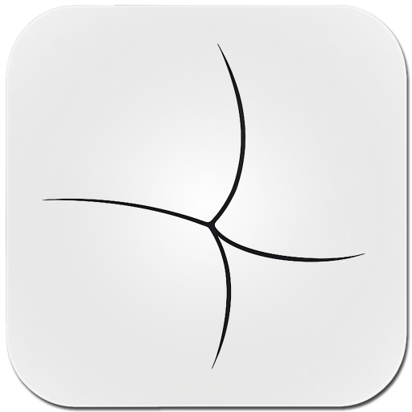

[English](README.md) · [Русский](.readme/lang/ru/README.md)

  

<h1 align="center">BarkFluff</h1>

  <strong>A self-hosted messaging platform engineered for real-time, distributed systems.</strong>

  <a href="#download">Download</a> ·
  <a href="#what-is-inside">Platform</a> ·
  <a href="#clients">Clients</a> ·
  <a href=".readme/README.md">Documentation</a>

  
  
  
  
  

---

BarkFluff pairs native clients with a gRPC-first .NET backend. Clients discover their service endpoints through Beacon, receive live changes through streaming updates, and communicate with independent services that can evolve and scale without turning the product into a distributed tangle.

  

## Download

  
  
  

  Windows, Android, and macOS release builds. Other clients are available from source below.

## What is inside

**One entry point.** Beacon gives clients one trusted way to discover the platform; Configuration supplies the service registry and runtime settings.

**Independent product services.** Identity, profiles, messaging, files, presence, calls, bots, federation, and more run as focused .NET services, with CQRS and MediatR where they fit.

**Real-time by default.** The Updates service uses persistent gRPC streams for live product events, while RabbitMQ carries asynchronous work between services.

**Built to operate.** PostgreSQL stores state, Redis serves hot data, MinIO handles objects, and Docker runs the stack. Native and web clients are built with Kotlin, WinUI, SwiftUI, Qt, and web technologies.

Read the [architecture guide](Obsidian/ClaudeVault/Архитектура.md) for ports, authentication, event delivery, and service conventions.

## Clients

- **Android** — Kotlin and gRPC-OkHttp · [build guide](.readme/clients/android.md)
- **Windows** — WinUI 3 and .NET · [build guide](.readme/clients/windows.md) · WPF client (legacy)
- **macOS** — SwiftUI and gRPC-Swift · [build guide](.readme/clients/macos.md)
- **iOS** — SwiftUI and gRPC-Swift · [build guide](.readme/clients/ios.md)
- **Linux** — Qt 6, C++20, and gRPC · [build guide](.readme/clients/linux.md)
- **Web** — gRPC-Web and a vanilla-JS SPA · [build guide](.readme/clients/web.md)

## Explore the repository

> ### 🧩 Platform
> [`Backend/`](Backend) contains the .NET microservices and web hosts. [`Shared/`](Shared) holds protobuf contracts and common .NET libraries.

> ### 📱 Clients
> [`Android/`](Android), [`Windows/`](Windows), [`Mac/`](Mac), [`iOS/`](iOS), and [`Linux/`](Linux) contain the native applications. [`Frontend/`](Frontend) contains the developer portal frontend.

> ### ⚙️ Infrastructure
> [`docker/`](docker) contains local platform and infrastructure stacks. [`Tests/`](Tests) contains automated and load tests.

> ### 📖 Documentation
> [`.readme/`](.readme) is the public setup hub; [`Obsidian/ClaudeVault/`](Obsidian/ClaudeVault) is the project knowledge base.

## Project status

> ### 🚧 Actively developed
> BarkFluff is under active development. Android V1 is the supported Android client; the Compose-based V2 project is experimental and should only change as part of an explicit task.

> ### ✅ Build health
> Client workflow status is shown above. Open [GitHub Actions](https://github.com/Liis17/BarkFluff/actions) for the complete matrix.

## Reference & documentation

> ### 🛠️ Run and operate
> [Backend setup](.readme/backend.md) · [Ports & environment](Backend/PORTS_CONFIGURATION.md) · [Docker reference](Backend/DOCKER_SETUP.md) · [Metrics catalogue](Backend/METRICS.md)

> ### 🤖 Integrate a bot
> [Bot API guide](.readme/bots.md) — capabilities, authentication, and REST endpoints for external bots.

> ### 📚 Learn the system
> [Documentation hub](.readme/README.md) · [Architecture](Obsidian/ClaudeVault/Архитектура.md) · [Project knowledge base](Obsidian/ClaudeVault/Index.md)

> ### ⚖️ License
> [MIT License](LICENSE)
