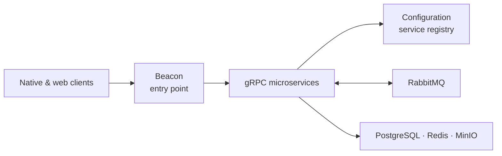

[English](README.md) · [Русский](.readme/lang/ru/README.md)

# BarkFluff

**A self-hosted, real-time messaging platform built as a distributed system.**

BarkFluff combines native clients with a gRPC-first .NET backend. It is designed around service discovery, streaming updates, and asynchronous messaging—so each part of the platform can evolve independently without losing the feel of one product.

## At a glance

| | |
|---|---|
| **Backend** | .NET 10, gRPC, RabbitMQ, PostgreSQL, Redis, MinIO, Docker |
| **Clients** | Android, Windows, macOS, iOS, Linux, and web |
| **Real time** | gRPC streaming through the Updates service |
| **Authentication** | XAuth: JWT plus device metadata |

## How it fits together



Clients ask **Beacon** for service endpoints, then communicate with individual services over gRPC. Services load their configuration from **Configuration**, publish asynchronous events through RabbitMQ, and use PostgreSQL, Redis, and MinIO where appropriate.

## Start here

| I want to… | Read |
|---|---|
| Run or build the backend | [.readme/backend.md](.readme/backend.md) |
| Build the Android client | [.readme/clients/android.md](.readme/clients/android.md) |
| Build the Windows client | [.readme/clients/windows.md](.readme/clients/windows.md) |
| Build the macOS client | [.readme/clients/macos.md](.readme/clients/macos.md) |
| Build the iOS client | [.readme/clients/ios.md](.readme/clients/ios.md) |
| Build the Linux client | [.readme/clients/linux.md](.readme/clients/linux.md) |
| Build the web client | [.readme/clients/web.md](.readme/clients/web.md) |
| Browse all public guides | [.readme/README.md](.readme/README.md) |

## Repository map

```text
BarkFluff/
├── Backend/       # .NET microservices and the web client host
├── Shared/        # protobuf contracts and shared .NET libraries
├── Android/       # Android V1 and experimental V2 clients
├── Windows/       # WPF client and supporting tools
├── Mac/           # SwiftUI macOS client and local Swift packages
├── iOS/           # SwiftUI iOS client
├── Linux/         # Qt 6 / C++20 client
├── Frontend/      # developer portal frontend
└── .readme/       # contributor-facing setup and build guides
```

## Further documentation

- [Backend ports and environment variables](Backend/PORTS_CONFIGURATION.md)
- [Docker setup reference](Backend/DOCKER_SETUP.md)
- [Metrics catalogue](Backend/METRICS.md)
- [Project knowledge base](Obsidian/ClaudeVault/Index.md)
- [MIT License](LICENSE)

## Status

BarkFluff is under active development. The Android V1 client is the supported Android implementation; the Compose-based V2 project is experimental and should not be changed without an explicit task.
