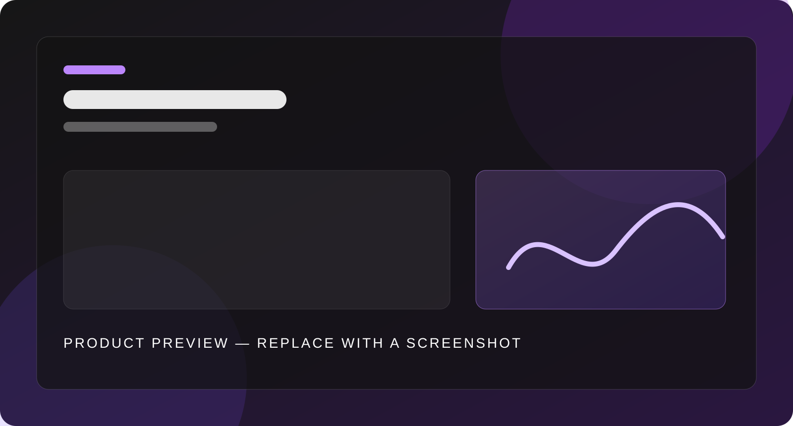
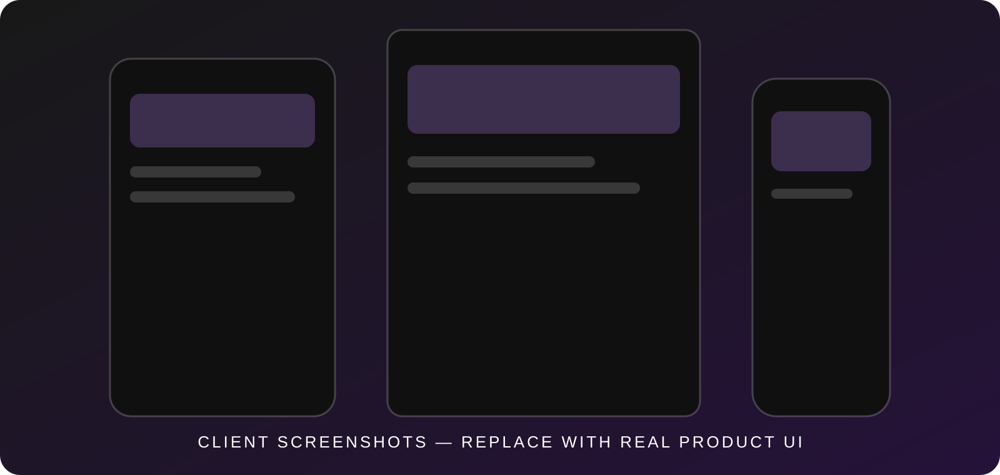

[English](README.md) · [Русский](.readme/lang/ru/README.md)

<p align="center">
  
</p>

<h1 align="center">BarkFluff</h1>

<p align="center">
  <strong>A self-hosted messaging platform engineered for real-time, distributed systems.</strong>
</p>

<p align="center">
  <a href="#run-the-platform">Get started</a> ·
  <a href="#architecture">Architecture</a> ·
  <a href="#clients">Clients</a> ·
  <a href=".readme/README.md">Documentation</a>
</p>

<p align="center">
  <a href="LICENSE"></a>
  <a href="https://github.com/Liis17/BarkFluff/actions/workflows/build-client-android.yml"></a>
  <a href="https://github.com/Liis17/BarkFluff/actions/workflows/build-client-wpf.yml"></a>
  <a href="https://github.com/Liis17/BarkFluff/actions/workflows/build-client-macos.yml"></a>
</p>

---

BarkFluff pairs native clients with a gRPC-first .NET backend. Clients discover their service endpoints through Beacon, receive live changes through streaming updates, and communicate with independent services that can evolve and scale without turning the product into a distributed tangle.

<p align="center">
  
</p>

## What is inside

**One entry point.** Beacon gives clients one trusted way to discover the platform; Configuration supplies the service registry and runtime settings.

**Independent product services.** Identity, profiles, messaging, files, presence, calls, bots, federation, and more run as focused .NET services, with CQRS and MediatR where they fit.

**Real-time by default.** The Updates service uses persistent gRPC streams for live product events, while RabbitMQ carries asynchronous work between services.

**Built to operate.** PostgreSQL stores state, Redis serves hot data, MinIO handles objects, and Docker runs the stack. Native and web clients are built with Kotlin, WPF, SwiftUI, Qt, and web technologies.

Read the [architecture guide](Obsidian/ClaudeVault/Архитектура.md) for ports, authentication, event delivery, and service conventions.

## Run the platform

The supplied development stack runs prebuilt backend images. You need Docker Engine with the Compose plugin, access to the private registry, and environment credentials that are deliberately kept outside Git.

```bash
cd docker/backend
docker login docker.barkfluff.com:5000
docker compose -f docker-compose-dev-backend.yml config
docker compose -f docker-compose-dev-backend.yml up -d
```

The [`Backend setup guide`](.readme/backend.md) covers the required environment, LiveKit configuration, image pull, safe shutdown, and source builds. To build one service while developing it:

```bash
dotnet build Backend/BarkFluff.Identity/BarkFluff.Identity.csproj
```

## Clients

<p align="center">
  
</p>

- **Android** — Kotlin and gRPC-OkHttp · [build guide](.readme/clients/android.md)
- **Windows** — WPF and .NET · [build guide](.readme/clients/windows.md)
- **macOS** — SwiftUI and gRPC-Swift · [build guide](.readme/clients/macos.md)
- **iOS** — SwiftUI and gRPC-Swift · [build guide](.readme/clients/ios.md)
- **Linux** — Qt 6, C++20, and gRPC · [build guide](.readme/clients/linux.md)
- **Web** — gRPC-Web and a vanilla-JS SPA · [build guide](.readme/clients/web.md)

## Repository map

```text
BarkFluff/
├── Backend/       # .NET microservices and web hosts
├── Shared/        # protobuf contracts and shared .NET libraries
├── Android/       # supported Android V1 and experimental V2
├── Windows/       # WPF clients and supporting tools
├── Mac/ · iOS/    # SwiftUI clients and local Swift packages
├── Linux/         # Qt 6 / C++20 client
├── Frontend/      # developer portal frontend
├── docker/        # local platform and infrastructure stacks
└── .readme/       # setup and build guides
```

## Project status

BarkFluff is actively developed. Android V1 is the supported Android client; the Compose-based V2 project is experimental and should only change as part of an explicit task.

Client workflow status is shown above; open [GitHub Actions](https://github.com/Liis17/BarkFluff/actions) for the complete matrix.

## Reference

- [Backend ports and environment variables](Backend/PORTS_CONFIGURATION.md)
- [Docker setup reference](Backend/DOCKER_SETUP.md)
- [Metrics catalogue](Backend/METRICS.md)
- [Project knowledge base](Obsidian/ClaudeVault/Index.md)
- [MIT License](LICENSE)
